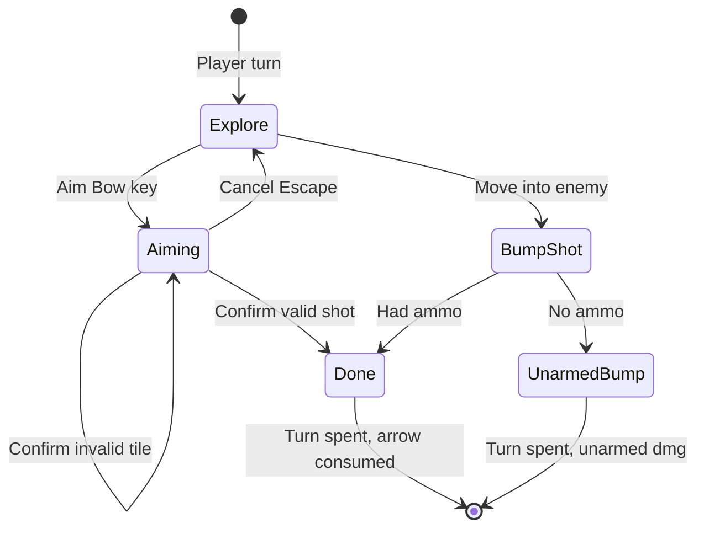

# Bow & Arrow — Requirements (DCSS-style ranged weapon + ammo)

A **one-handed bow** is an equippable **weapon** (`MainHand`). **Arrows** are **`ItemCategory.Missile`** ammo equipped in **`OffHand`** (default arrow stack). Shooting consumes **one arrow per normal attack** (extensible for multi-arrow abilities later). The player **aims** with a new input (targeting reticle) or **bumps** an enemy to fire without the reticle. Damage follows a **Dungeon Crawl Stone Soup**–style launcher + ammo base sum, scaled by weapon skill and fighting-like modifiers.

**Depends on:** `ItemData`, `ItemInstance`, `EquipmentManager`, `EquipmentLegalityEvaluator`, `InventoryUI` (equip / invoke), `InventoryManager.TryConsumeCarriedQuantity`, `PlayerCommandProcessor`, `InputHandler`, `InputState.Targeting`, `TargetingReticleView`, `TargetingResolver.GetTargetsOnTile`, `TurnManager`, `PlayerController.OnBump`, `CharacterStats.WeaponProficiencies[WeaponType.Bow]`, [Throwing Knife](../Inventory/Throwing-Knife-Requirements.md) (single-tile targeted strike pattern), [Fireball Scroll](../Inventory/Fireball-Scroll-Requirements.md) (reticle confirm/cancel), [Multi-tile enemies](Multi-Tile-Enemy-Requirements.md), [Inventory UI redesign](../Inventory/Inventory-UI-Redesign-Requirements.md).

**Related (today):** Melee bump → `PlayerController.AttackEnemy` using `EquipmentManager.GetTotalAttack`. No bow/ammo coupling. Off-hand accepts any legal `slotType`. No dedicated **Aim** binding in `GameControls`.

**Explicitly out of scope (v0):** Line-of-sight / range limits; to-hit rolls and AC reduction; arrow brands (fire, silver, etc.); quiver item type separate from equipped stack; two-handed longbows; crossbows; auto-pickup equipping arrows; NPC archery AI; arrow-throwing; shield + bow penalties; enchantment/slaying on bow or arrows; save/load mid-aim session.

**Product approval (art):** **Option A** — Idylwild Aerial Arsenal (`bow2`, `arrow1`, `arrow2`) (2026-05-29). **Icons imported** under `Assets/Art/Items/Sprites/`; gameplay implementation deferred (§14).

---

## 1. Goals

**G1 — One-handed bow weapon**  
Bow equips to **MainHand**, requires **one hand** (off-hand remains free for arrow stack).

**G2 — Arrows in off-hand**  
Player designates **default ammo** by equipping a **stack of arrows** to **OffHand** from inventory. Equip/unequip arrows **does not** consume a turn.

**G3 — Bow gates off-hand**  
While a **bow** is in MainHand, **only arrow ammo** may equip in OffHand (no shields, second weapons, etc.).

**G4 — Consume one arrow per shot (extensible)**  
Normal bow attacks call a single **`AmmoConsumptionRequest`** API with `count = 1`; future abilities may pass `count > 1`.

**G5 — Auto-promote next arrow stack**  
When the equipped (default) stack hits **0**, immediately equip the **next** carried arrow stack (stable sort: same as inventory list order). If none remain, log and leave off-hand empty.

**G6 — Aim key + reticle**  
New **Aim Bow** input enters targeting (like scroll/knife). **Escape** cancels aim **without** consuming a turn or arrow.

**G7 — Bump shot**  
Moving into an enemy while wielding a bow **fires one arrow** at that enemy’s tile **without** opening the reticle. **No arrows** → fall back to **unarmed** bump attack (no weapon damage modules).

**G8 — Invoke arrow from inventory**  
With bow equipped, **Use** on a **carried** arrow stack (any type) enters aim mode using **that** stack (same as aiming with those arrows equipped). Does not consume a turn until confirm.

**G9 — Turn parity with melee**  
Successful aim confirm or bump shot **consumes the active member’s action** (same as sword bump / scroll confirm).

**G10 — Friendly fire allowed on aimed tile**  
Reticle confirm damages **all valid occupants** on the tile, including **party members** (unlike throwing knife v0).

**G11 — Cannot throw arrows**  
Arrows are **not** usable as thrown missiles; `Use` without a bow equipped is blocked with log.

**G12 — DCSS-inspired damage**  
Damage computed from **bow + arrow** base, **Bow proficiency**, and a **Fighting-analog** modifier (§8).

**G13 — Sample content + art**  
Ship **Short Bow**, **Stone Arrow**, **Steel Arrow** items, world prefabs, editor seed menus, and imported sprites (§13).

**G14 — Debug traceability**  
Prefix **`[Bow]`** for bow/aim/ammo logs.

---

## 2. Glossary

| Term | Meaning |
|------|--------|
| **Bow** | `ItemCategory.Weapon` with `weaponType = Bow`, `handsRequired = 1`, equips **MainHand**. |
| **Arrow ammo** | `ItemCategory.Missile` with `requiresBow = true`, equips **OffHand** only when bow wielded. |
| **Default arrows** | The `ItemInstance` currently equipped in **OffHand**. |
| **Invoke arrow** | Inventory **Use** on a carried arrow stack while bow equipped → enter aim using that stack. |
| **Aim mode** | `InputState.Targeting` driven by bow (not scroll/knife ability asset). |
| **Bump shot** | Enemy bump resolves as ranged shot at occupant tile (no reticle). |
| **Ammo consumption** | `TryConsumeEquippedAmmo(owner, count)` (§7). |

---

## 3. Current baseline (as-is)

| Area | Today |
|------|--------|
| **Melee bump** | `PlayerController.OnBump` → `AttackEnemy` (slash damage, `GetTotalAttack`). |
| **Equipment slots** | `EquipItem` swaps by `item.slotType`; no cross-slot rules (bow ↔ arrow). |
| **Off-hand** | Any item with `slotType = OffHand` can equip. |
| **Missiles** | Throwing knife uses targeted `activeAbilities`; arrows must **not** reuse throw path. |
| **Ammo quantity** | `TryConsumeCarriedQuantity` exists for carried stacks. |
| **Weapon proficiencies** | `CharacterStats.WeaponProficiencies[WeaponType.Bow]` initialized (value 0 default). |
| **Input** | Move, Wait, Confirm/Cancel target, Ability slots; **no Aim Bow**. |

---

## 4. Content authoring

### D4.1 — Short Bow — `Weapon_ShortBow`

| Field | Requirement |
|-------|-------------|
| **`itemName`** | `Short Bow` |
| **`category`** | `ItemCategory.Weapon` |
| **`slotType`** | `EquipmentSlot.MainHand` |
| **`weaponType`** | `WeaponType.Bow` (new field on `ItemData`, §6.1) |
| **`handsRequired`** | **1** |
| **`weight`** | **2.0** |
| **`damageModules`** | Pierce **8** (DCSS shortbow baseline, v0.31) |
| **`icon`** | `Assets/Art/Items/Sprites/Weapon_ShortBow.png` |
| **`goldValue`** | e.g. **80** |

**Suggested path:** `Assets/Resources/Item/Weapon/Weapon_ShortBow.asset`

### D4.2 — Stone Arrow — `Missile_StoneArrow`

| Field | Requirement |
|-------|-------------|
| **`itemName`** | `Stone Arrow` |
| **`category`** | `ItemCategory.Missile` |
| **`slotType`** | `EquipmentSlot.OffHand` |
| **`requiresBow`** | **true** |
| **`isThrowable`** | **false** |
| **`weight`** | **0.05** per arrow |
| **`damageModules`** | Pierce **+2** (ammo additive base; crude stone) |
| **`icon`** | `Missile_StoneArrow.png` |
| **`goldValue`** | **3** per arrow |
| **`requiresAppraisal`** | **false** |

**Suggested path:** `Assets/Resources/Item/Missile/Missile_StoneArrow.asset`

### D4.3 — Steel Arrow — `Missile_SteelArrow`

| Field | Requirement |
|-------|-------------|
| **`itemName`** | `Steel Arrow` |
| **`category`** | `ItemCategory.Missile` |
| **`slotType`** | `EquipmentSlot.OffHand` |
| **`requiresBow`** | **true** |
| **`isThrowable`** | **false** |
| **`weight`** | **0.08** per arrow |
| **`damageModules`** | Pierce **+4** (steel material tier; DCSS “steel” missile brand analogue) |
| **`icon`** | `Missile_SteelArrow.png` |
| **`goldValue`** | **8** per arrow |

**Suggested path:** `Assets/Resources/Item/Missile/Missile_SteelArrow.asset`

### D4.4 — World prefabs

Mirror `WorldItem_ThrowingKnife`:

- `Assets/Prefabs/Item/WorldItem_ShortBow.prefab`
- `Assets/Prefabs/Item/WorldItem_StoneArrow.prefab` (optional stack qty in pickup instance)
- `Assets/Prefabs/Item/WorldItem_SteelArrow.prefab`

### D4.5 — Editor QA (SampleScene)

| Menu | Action |
|------|--------|
| **`JRogue/Inventory/Seed Bow Kit on Party_Barbarian_Warrior`** | MainHand bow + OffHand stone ×20; carried steel ×10 |
| **`JRogue/Inventory/Place Bow Kit in SampleScene`** | World pickups for bow + arrows |

---

## 5. Equipment rules (locked)

### E5.1 — Bow equip (MainHand)

- Legal when `slotType == MainHand` and item is flagged as bow (`weaponType == Bow` or `isRangedBow`).
- Equipping a bow **does not** consume a turn.
- If OffHand holds a **non-arrow**, force unequip to bag (or block bow equip with reason — **locked: unequip illegal off-hand to bag if possible, else block bow equip**).

### E5.2 — Arrow equip (OffHand) = default ammo

- Player equips arrow stack from inventory (**Equip** action) into **OffHand**.
- **`EquipmentLegalityEvaluator`** extension:
  - Arrow (`requiresBow`) → only if actor has bow in MainHand.
  - Non-arrow → only if MainHand is **not** a bow.
  - Bow in MainHand → OffHand accepts **only** `requiresBow` missiles.

### E5.3 — Changing arrows (inventory)

- Equipping a different arrow stack in OffHand swaps default ammo.
- **No turn** spent.
- Inspect pane shows **“Equipped as ammo (Off Hand)”** for equipped arrow row.

### E5.4 — Unequip bow

- Unequipping bow to bag: if OffHand has arrows, **auto-unequip arrows to bag** (if encumbrance allows) or block with warning.

---

## 6. Data model extensions

### D6.1 — `ItemData` fields (new)

```csharp
public WeaponType weaponType;      // Bow, Sword, … — for proficiencies & UI
public int handsRequired = 1;    // Bow v0: 1
public bool requiresBow;         // true on arrow ammo
public bool isThrowable = true;  // false on arrows
```

Arrows: `requiresBow = true`, `isThrowable = false`, `category = Missile`, `slotType = OffHand`.

### D6.2 — `BowRangedCombatService` (new static or service)

Central API for:

| Method | Purpose |
|--------|---------|
| `bool HasBowEquipped(BaseActor actor)` | MainHand weapon is bow |
| `bool TryGetEquippedArrowStack(BaseActor, out ItemInstance)` | OffHand ammo |
| `bool TryConsumeAmmo(BaseActor, int count, out ItemData consumedDef)` | Extensible consumption |
| `void TryPromoteNextArrowStack(BaseActor)` | After stack empty |
| `int ComputeBowShotDamage(BaseActor, ItemData bow, ItemData arrow)` | §8 formula |
| `bool TryExecuteBowShot(BaseActor, Vector3Int targetTile, int ammoCount = 1)` | Damage + consume + noise |

---

## 7. Ammo consumption (extensible)

### D7.1 — `TryConsumeAmmo(actor, ammoCount, ...)`

**v0 normal attack:** `ammoCount = 1`.

**Algorithm:**

1. Read equipped OffHand `ItemInstance` stack.
2. If null → return **false** (caller logs §10).
3. `TryConsumeCarriedQuantity(equippedInstance, ammoCount)` — arrows remain **equipped** entries in `EquipmentManager` dictionary even when quantity hits 0 (remove instance from OffHand slot).
4. If quantity reached **0** → `TryPromoteNextArrowStack(actor)`:
   - Scan **carried** items: `requiresBow && category == Missile`, stable inventory order.
   - First stack with `quantity > 0` → `EquipItem(OffHand, thatInstance)` **without turn**.
   - If none: `Debug.Log("[Bow] No arrows remaining.")`.

### D7.2 — Future multi-arrow abilities

Abilities call `TryExecuteBowShot(..., ammoCount: N)` or `TryConsumeAmmo(actor, N)` before effect resolution. Missing ammo → ability fails early.

---

## 8. Damage formula (DCSS-inspired, v0)

Reference: [DCSS weapon damage](http://crawl.chaosforge.org/Weapon_damage), [shortbow](http://crawl.chaosforge.org/Shortbow), classic launcher+ammo sum (pre-0.29 ammo removal).

### D8.1 — Combined base (launcher + ammo)

```
baseDamage = Sum(bow.damageModules.value) + Sum(arrow.damageModules.value)
```

**v0 authored totals:**

| Loadout | Bow | Arrow | **Base** |
|---------|-----|-------|----------|
| Short bow + stone | 8 | +2 | **10** |
| Short bow + steel | 8 | +4 | **12** |

Damage type: **Pierce** (primary module on both).

### D8.2 — Skill modifiers (v0 deterministic average)

DCSS uses random uniform rolls; v0 uses **expected values** for stable testing:

```
bowSkill = WeaponProficiencies[WeaponType.Bow].GetValue()
fightSkill = Skills[Athletics].GetValue()   // Fighting analogue until Fighting exists

skillMod    = 1f + bowSkill / 25f          // DCSS: 1 + uniform(weaponSkill)/25
fightingMod = 1f + fightSkill / 30f        // DCSS: 1 + uniform(Fighting)/30

damage = Round(baseDamage * skillMod * fightingMod)
```

Minimum **1** damage on hit.

### D8.3 — Out of scope in v0 formula

- Strength modifier on ranged (DCSS melee-biased STR on some versions)
- AC reduction (`uniform(AC)`)
- Slaying / enchantment
- Brand effects (steel as +base only, not `%` brand)

### D8.4 — Inspect UI text

Detail pane shows: `Ranged: 10 (8+2) × skill × fighting` breakdown when bow + equipped arrow selected.

---

## 9. Player flows

### F9.1 — Equip bow + default arrows (inventory, no turn)

1. Equip **Short Bow** → MainHand.
2. Equip **Stone Arrow ×N** → OffHand (only legal while bow equipped).
3. Log optional: `[Bow] Default ammo: Stone Arrow ×N.`

### F9.2 — Aim Bow (new input)

**Preconditions:**

- `GameState.PLAYER_TURN`
- `CanActorTakeAction(activeMember)`
- Bow in MainHand
- At least one arrow available (equipped stack **or** carried stack for invoke path — §9.4)

**Flow:**

1. Player presses **Aim Bow** (`GameControls` binding, §11).
2. Enter `InputState.Targeting` with pending source **`PlayerAbilitySource.BowAim`** (new).
3. Reticle at active member tile.
4. **Confirm** → §9.5.
5. **Cancel (Escape)** → exit targeting, **no turn**, **no arrow**.

`InventoryUI.BlocksGameplay` false while aiming (panel closed if was open).

### F9.3 — Bump shot (no reticle)

1. Player moves into enemy tile (existing move/bump path).
2. If MainHand is bow:
   - If `TryConsumeAmmo(1)` and valid target on tile → apply `TryExecuteBowShot` damage at tile, **consume turn** (same as melee bump).
   - If **no ammo** → `Debug.Log("[Bow] No arrows; bump uses unarmed.")` → `AttackEnemy` with **unarmed** damage only (`baseAttack`, no weapon modules) OR pure bump with no damage — **locked: use `baseAttack` only, no slash weapon modules**.
3. If MainHand is not bow → existing melee `AttackEnemy`.

### F9.4 — Invoke arrow (inventory Use)

1. Bow equipped in MainHand.
2. Player highlights **carried** arrow row (stone or steel) → **Use**.
3. If `requiresBow && !isThrowable`:
   - If stack not in OffHand: **temporarily treat this stack as aim ammo** (either auto-equip swap without turn, or pending state holds explicit `ItemInstance` — **locked: swap equipped OffHand to invoked stack without turn** before aim).
4. Enter aim mode (§9.2) using invoked arrow type.
5. Cancel → restore previous OffHand equipped stack **without turn** (if swap occurred).

### F9.5 — Aim confirm

1. `targetTile = reticle.Position`.
2. `TryExecuteBowShot(activeMember, targetTile, ammoCount: 1)`:
   - `TargetingResolver.GetTargetsOnTile(targetTile)` — damage **all** occupants (including allies).
   - If **no occupants** → **invalid** (stay in aim, no arrow, no turn) — same invalid pattern as throwing knife.
3. On success: consume arrow, end turn, exit targeting.
4. Log: `[Bow] Shot at (x,y,z) for {damage} with {arrowName}.`

### F9.6 — Aim with no ammo

Press **Aim Bow** or **Use** arrow when no stacks left:

- `Debug.Log("[Bow] Cannot shoot: no arrows.")`
- **No turn**, no targeting.

### F9.7 — Attempt Use arrow without bow

- `Debug.Log("[Bow] Arrows require a bow.")` — no targeting, no turn.

### F9.8 — Arrows not throwable

- `InventoryUsability` / `InventoryItemUse`: if `requiresBow && !isThrowable` and no bow equipped → fail.
- No `activeAbilities` on arrow items (do not use knife/scroll targeted consumable path).

### F9.9 — Flow diagram



---

## 10. Debug logging contract

Prefix: **`[Bow]`**.

| Event | Example |
|-------|---------|
| Default ammo equipped | `Default ammo: Stone Arrow ×20.` |
| Promoted next stack | `Promoted ammo: Steel Arrow ×10.` |
| No arrows left | `No arrows remaining.` |
| Cannot shoot | `Cannot shoot: no arrows.` |
| Arrows require bow | `Arrows require a bow.` |
| Bump fallback | `No arrows; bump uses unarmed.` |
| Shot success | `Shot at (2,0,0) for 10 with Stone Arrow.` |
| Illegal off-hand with bow | `Cannot equip Shield: bow requires arrow ammo in off hand.` |

---

## 11. Input (`GameControls`)

### D11.1 — New action: **Aim Bow**

| Property | Value |
|----------|--------|
| **Action name** | `AimBow` |
| **Map** | **`a`** (keyboard) — v0 default; rebindable in Input System UI |
| **Processor path** | `InputHandler` → `PlayerCommandKind.AimBow` → `PlayerCommandProcessor.TryBeginBowAim()` |
| **While inventory open** | **Ignored** (or routes to inventory letter — **locked: ignored while `InventoryUI.BlocksGameplay`**) |
| **While other targeting** | Ignored |

### D11.2 — Targeting bindings (unchanged)

- **Confirm** — same as essence/scroll confirm.
- **Cancel** — `CancelTarget` (Escape).

---

## 12. Implementation design (locked)

### D12.1 — `PlayerAbilitySource.BowAim`

Extend `PendingTargetedAbility` or parallel struct:

| Field | Purpose |
|-------|---------|
| `AmmoInstance` | Stack consumed on confirm |
| `ResumeOffHandAfterInvoke` | Restore prior default after cancel (invoke path) |

`ApplyConfirmTarget` / `ApplyCancelTarget` branches for `BowAim`.

### D12.2 — `PlayerController.OnBump` branch

```csharp
if (HasBowEquipped(this)) {
  if (BowRangedCombatService.TryExecuteBowShot(this, target.GridPosition, 1))
    return; // turn ended by caller
  // fallback unarmed
}
AttackEnemy(enemy); // existing
```

Refactor: extract shot logic so bump and aim share `TryExecuteBowShot`.

### D12.3 — `EquipmentManager.EquipItem` hooks

After equip/unequip:

- Enforce §5.3 off-hand legality.
- On arrow stack depletion during combat → call `TryPromoteNextArrowStack`.

### D12.4 — Inventory

- **Equip** arrow: only OffHand + bow check.
- **Use** arrow: invoke path §9.4 (not `InventoryItemUse` consumable ability).
- Detail formatter: show ranged damage preview via `ComputeBowShotDamage`.

### D12.5 — Noise

Bow shot noise quieter than fireball; suggest **`noiseVolume = 15`**, origin at **target tile**.

---

## 13. Art — Idylwild Aerial Arsenal (Option A, approved & imported)

| Item | Source file | Game sprite |
|------|-------------|-------------|
| **Short Bow** | `bow2.png` | `Assets/Art/Items/Sprites/Weapon_ShortBow.png` |
| **Stone Arrow** | `arrow1.png` | `Assets/Art/Items/Sprites/Missile_StoneArrow.png` |
| **Steel Arrow** | `arrow2.png` | `Assets/Art/Items/Sprites/Missile_SteelArrow.png` |

| | |
|--|--|
| **Pack** | [Idylwild's Aerial Arsenal](https://opengameart.org/content/idylwilds-aerial-arsenal) |
| **License** | Permissive (commercial OK; attribution appreciated) |
| **Import** | PPU **32**, point filter — see `Assets/Art/Items/ThirdParty/IdylwildAerialArsenal/README.md` |

### Declined alternatives

| Option | Why |
|--------|-----|
| CC0 Ranged Icons (mixed 32×32) | Option A already in repo with knife; consistent set |
| Bows and Guns CC0 | Guns not needed; bows less readable at 32×32 in preview |
| DCSS crawl-tiles only | Harder to distinguish stone vs steel at a glance |

---

## 14. Acceptance criteria

| ID | Test |
|----|------|
| **AC1** | Equip bow + stone arrows; OffHand shows stack; no turn spent. |
| **AC2** | With bow equipped, cannot equip shield in OffHand (blocked + log). |
| **AC3** | **Aim** → reticle → cancel → no arrow consumed, can still act. |
| **AC4** | Aim confirm on enemy tile → damage, −1 arrow, turn ends. |
| **AC5** | Aim confirm on ally tile → ally damaged (friendly fire). |
| **AC6** | Bump enemy with bow + ammo → damage without reticle, turn ends. |
| **AC7** | Bump with bow, no ammo → unarmed damage only + log. |
| **AC8** | Last stone arrow fired → steel stack auto-equips OffHand. |
| **AC9** | No arrows anywhere → Aim logs, no turn; Use arrow without bow logs. |
| **AC10** | Invoke steel from inventory → aim fires steel damage (12 base before mods). |
| **AC11** | Arrows cannot start throw-knife-style targeting without bow. |

---

## 15. Implementation checklist

- [x] `ItemData` weapon/ammo fields (§6.1)
- [x] `Weapon_ShortBow`, `Missile_StoneArrow`, `Missile_SteelArrow` assets + icons assigned
- [x] `BowRangedCombatService` + damage formula (§8)
- [x] `EquipmentLegalityEvaluator` bow/off-hand rules (§5)
- [x] `TryPromoteNextArrowStack` (§7)
- [x] `GameControls` **AimBow** + `PlayerCommandProcessor` BowAim confirm/cancel
- [x] `PlayerController` bump branch (§9.3)
- [x] Inventory invoke + equip UX (§9.4, §12.4)
- [x] Block arrow throw / misuse logs (§9.8)
- [x] World prefabs + editor seed menus (§4.5)
- [x] Unit tests: legality, ammo consume, promote, damage formula, no-turn equip
- [ ] Play-mode AC1–AC11

---

## 16. Document history

| Date | Note |
|------|------|
| 2026-05-29 | Initial requirements; DCSS damage; Idylwild art imported (Option A) |
