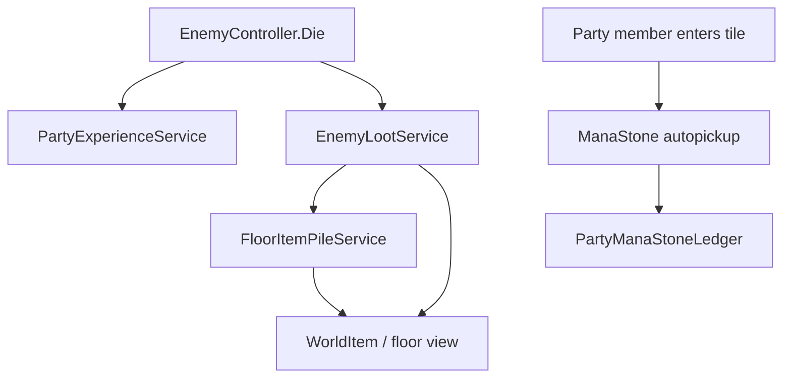

# Enemy death loot & mana stones — Requirements

On defeat, enemies may drop **zero or more** items onto the ground at their death tile, using **per-species loot tables** with independent **drop chance** rolls (0–100%). **Mana stones** are a first-class currency inspired by *Surviving the Game as a Barbarian* (**STBGB**): weightless, party-pooled, tiered, tagged with the **species that dropped them**, visible on the map until collected, and **auto-picked up** when any party member enters the tile.

**Depends on:** `EnemyController` / `BaseActor.Die`, `EnemySpeciesDefinition`, `GridManager` / `Vector3Int` grid cells, `ItemData`, `ItemInstance`, `ItemCategory.Currency`, `PartyCurrencyLedger`, `InventoryManager`, `PartyManager`, `PartyExperienceService` (species ids). Floor placement integrates with [Floor item piles](../Inventory/Floor-Item-Pile-Requirements.md) when implemented; until then, **`WorldItem`** or equivalent spawn API.

**Related:** [Party experience & leveling](../Progression/Party-Experience-And-Leveling-Requirements.md) (`skeleton` vs `giant_skeleton` species ids). [Multi-tile enemies](Multi-Tile-Enemy-Requirements.md) (drop anchor on footprint). [Inventory UI redesign](../Inventory/Inventory-UI-Redesign-Requirements.md) (currency strip). [Floor item piles](../Inventory/Floor-Item-Pile-Requirements.md) (general pickup rules; **mana stone autopickup is an explicit exception**, §6). [Enemy essence drops](../Essence/Enemy-Essence-Drops-Requirements.md) (`LootTablePayload.Essence`, floor lifetime).

---

## 1. Goals

**G1 — Data-driven death loot (v0)**  
Every enemy species that can drop loot references a **`EnemyLootTable`** asset. Each table has **N ≥ 0** independent entries; each entry has a **drop chance** in `[0, 1]` (0–100%). On death, the game rolls each entry and spawns drops that succeed. Different species (e.g. Skeleton vs Giant Skeleton) use **different** tables.

**G2 — Mana stones (v0)**  
Mana stones exist as droppable, mappable currency with **tier** (1–9) and **source species**, zero weight, unlimited carry, party wallet pooling, and **auto-pickup on tile entry** by any party member.

**G3 — STBGB / DCSS alignment**  
Matches the design intent of varied corpse loot (DCSS) and STBGB-style mana stones as a distinct progression currency—not generic inventory clutter.

**G4 — Verifiable content (v0)**  
Skeleton and Giant Skeleton loot tables match §8 exactly so designers and automated tests can confirm rolls and pooling without guesswork.

**G5 — Physical deliverables**  
Shipping assets include mana stone `ItemData` (with map icon), loot table assets for both skeleton species, and wiring from `EnemySpeciesDefinition` → loot table.

---

## 2. Reference — DCSS & STBGB (design intent)

| Reference idea | This project (v0) |
|----------------|-------------------|
| DCSS: monsters may drop nothing or several items | **Independent rolls** per loot table entry; zero successes → no drops |
| DCSS: drop rates per monster type | **`EnemyLootTable`** per species (or per enemy definition) |
| STBGB: mana stones as special currency | **`ItemCategory.Currency`**, party ledger, tier + source species |
| STBGB: stones differ by quality / origin | **Tier 1–9** + **species that dropped** on each instance |
| DCSS: some items autopickup | **Mana stones only** auto-pickup on step (§6); other loot uses manual pickup per floor-pile spec |

---

## 3. Glossary

| Term | Definition |
|------|------------|
| **Loot table** | ScriptableObject listing drop **entries** for one enemy species (or prefab). |
| **Drop entry** | One possible drop: payload (e.g. mana stone tier) + **drop chance** + optional count range (v0: count = 1 per successful roll). |
| **Drop chance** | Float `0f … 1f` (Inspector 0–100%). Each entry rolled **independently** on death. |
| **Death tile** | Grid cell where loot is placed—**anchor cell** of the defeated enemy (`GridPosition`) for v0. |
| **Mana stone** | Currency item with **tier**, **source species id**, weight **0**, map icon, autopickup. |
| **Tier** | Integer **1–9**. **9 = lowest** quality/value band; **1 = highest**. |
| **Source species** | `speciesId` of the enemy that died and generated the stone (e.g. `skeleton`). Stored on the **runtime instance**, not only on the table. |

---

## 4. Enemy death loot — rules

### 4.1 — When loot is evaluated

- Trigger in the enemy **death pipeline** immediately after defeat is confirmed and **before** the enemy `GameObject` is destroyed—same phase as [party XP](../Progression/Party-Experience-And-Leveling-Requirements.md) (`EnemyController.Die` → loot service).
- Uses the dying enemy’s **`EnemySpeciesDefinition`** (must have non-empty `speciesId` for species-tagged drops like mana stones).

### 4.2 — Drop location

| Case | v0 drop tile |
|------|----------------|
| 1×1 enemy | `GridPosition` (anchor) |
| Multi-tile enemy | **Anchor** `GridPosition` only (loot pile on one cell); spreading across footprint is **future** |

- Multiple successful rolls on the same death may place **multiple entries** on the **same tile** (pile).

### 4.3 — Roll algorithm (v0)

For each entry `e` in the species loot table (in list order):

1. Draw `r = Random.value` (uniform `[0, 1)`).
2. If `r <= e.dropChance`, spawn the drop **once** (v0: quantity per entry = **1**).
3. Otherwise skip entry.

Properties:

- Entries are **independent** (two 100% entries ⇒ two drops; 100% + 50% ⇒ always first, second with 50% probability).
- **No** guaranteed “at least one drop” unless authored.
- **No** mutual exclusion groups in v0 (future: “pick one of” groups).

### 4.4 — What can be dropped (payload types)

| Payload type | v0 |
|--------------|-----|
| **Mana stone** (tier fixed per entry) | **Yes** — §5 |
| Generic `ItemData` (weapon, potion, gold pile, etc.) | **Yes** — standard floor item / `ItemInstance` |
| Procedural / rarity tables | **Future** |

### 4.5 — Species without loot

- Enemies with **no** loot table assigned, or an **empty** table, drop **nothing** from this system (0% implicit).
- XP and loot are **orthogonal** (first-kill XP journal does not affect drop rolls).

---

## 5. Data model — loot tables

### 5.1 — `EnemyLootTable` (ScriptableObject)

Suggested menu: `JRogue/Enemy/Loot Table`.

| Field | Type | Notes |
|-------|------|--------|
| `displayName` | string | Editor / debug |
| `entries` | `List<LootTableEntry>` | Order = roll order |

### 5.2 — `LootTableEntry`

| Field | Type | Notes |
|-------|------|--------|
| `dropChance` | float `[0, 1]` | Inspector: 0–100% |
| `payload` | enum or union | v0: `ManaStone`, `ItemData` |
| `manaStoneTier` | int `1…9` | When payload = ManaStone |
| `itemData` | `ItemData` | When payload = ItemData |
| `quantity` | int | v0 default **1** |

### 5.3 — Link to species

Extend **`EnemySpeciesDefinition`** (or parallel reference on `EnemyController`) with:

| Field | Type |
|-------|------|
| `lootTable` | `EnemyLootTable` (optional) |

- **`SkeletonSpecies`** → table §8.1  
- **`GiantSkeletonSpecies`** → table §8.2  

### 5.4 — Spawn API

**`EnemyLootService`** (or method on existing progression/loot manager):

```text
void SpawnDeathLoot(EnemyController enemy, Vector3Int tile)
```

- Reads `enemy.Species.lootTable`, runs §4.3, calls floor spawn for each success.
- Mana stones: create `ItemInstance` with tier definition + **source species id** = `enemy.Species.speciesId` (§5.5).
- Logs (debug): `"[LOOT] {species} dropped {payload} at {tile}"` / `"[LOOT] {species} dropped nothing"`.

Floor integration:

- **Preferred:** `FloorItemPileService.AddEntry(tile, instance)` per [floor piles](../Inventory/Floor-Item-Pile-Requirements.md).
- **Until piles ship:** `WorldItem` prefab or dedicated **`FloorManaStoneView`** at tile center `(x + 0.5, y + 0.5)`.

---

## 6. Mana stones — requirements

### 6.1 — Design summary

| Property | Value |
|----------|--------|
| Category | **`ItemCategory.Currency`** (same class as gold in UX strip) |
| Weight | **0** — does not consume encumbrance; **unlimited** carry count |
| Pooling | **Party-wide** ledger (like gold), not per-member bags |
| Map presence | Visible on ground with **icon** until collected |
| Pickup | **Auto** when **any** `PartyManager.partyMembers` member **enters** the tile (grid cell match) |
| Identity | **Tier** (1–9) + **source species id** per stone / stack key |

### 6.2 — Tier scale

| Tier | Meaning (v0) |
|------|----------------|
| **9** | Lowest band |
| **8** | … |
| … | … |
| **1** | Highest band |

- Validation: tier ∈ `[1, 9]` inclusive; invalid tier rejected at edit time and runtime.
- **Display:** UI shows tier (e.g. “Mana Stone (T9)” or “Tier 9 · Skeleton”).
- **Future:** tier affects shop rates, crafting, appraisal value—v0 only stores and displays tier.

### 6.3 — Source species

- On drop from enemy death, set **`sourceSpeciesId`** = dying enemy’s `EnemySpeciesDefinition.speciesId`.
- Persists on `ItemInstance` (new serialized field, e.g. `provenanceSpeciesId` or `manaStoneSourceSpeciesId`).
- Shown in inspect UI and used for ledger stacking key (§6.5).
- Stones dropped from non-enemy sources (chests, debug) use a configured id or `"unknown"` (document in implementation).

### 6.4 — `ItemData` — mana stone definition

- One approach (recommended v0): **`ManaStoneItemData`** extends or sits beside `ItemData` with:
  - `category = Currency`
  - `weight = 0`
  - `icon` = **Diamond** sprite (§6.8)
  - `tier` = 1…9 on the asset **or** separate assets per tier (`ManaStone_Tier9`, …) with tier field duplicated for UI
- **Not** appraised as gold value in v0 unless design adds `goldValue` later.
- `itemName` pattern: e.g. `"Mana Stone (Tier 9)"` or localized equivalent.

### 6.5 — Party storage (ledger)

**`PartyCurrencyLedger`** today keys only by `ItemData` — insufficient for mana stones (same tier, different species).

**v0 requirement:** extend or add **`PartyManaStoneLedger`** (or extend currency ledger) keyed by **`(tier, sourceSpeciesId)` → count**.

| Operation | Behavior |
|-----------|----------|
| Pickup | `Add(tier, sourceSpeciesId, +1)` |
| Spend / craft (future) | `TrySpend(tier, sourceSpeciesId, amount)` |
| UI strip | List non-zero stacks; sort by tier then species display name |

Pickup path:

1. Party member enters tile with mana stone on ground.
2. Autopickup runs (§6.6) — **no turn spent** (incidental collection).
3. Ledger increments; floor entry / `WorldItem` removed.

**Gold** may remain on `PartyCurrencyLedger`; mana stones **must not** use encumbrance checks in `InventoryManager.CanCarry`.

### 6.6 — Auto-pickup (exception to floor-pile default)

[Floor item piles](../Inventory/Floor-Item-Pile-Requirements.md) state **no** autopickup on walk for general items. **Mana stones override that:**

| Rule | Detail |
|------|--------|
| Trigger | Any party member’s `GridPosition` (or footprint cells—match movement registration) **enters** a tile that has ≥1 mana stone on the ground |
| Who collects | **Party** (same as currency pool) |
| Turn cost | **None** for v0 |
| Scope | **Only** items flagged `autoPickupOnStep` or category ManaStone / currency subtype |
| Disable | **Future:** player option to ignore autopickup |

Implementation options (pick one in code):

- `ManaStoneAutoPickupService` listening to `GridMover` / party position changes, or  
- Extend `InventoryCollector` with a **whitelist** for zero-weight currency mana stones only (and remove generic `WorldItem` walk-over for non-autopickup items per floor-pile spec).

**Disable** legacy blind `WorldItem` trigger pickup for potions/equipment when floor piles ship; mana stones remain the exception.

### 6.7 — Weight & encumbrance

- `ItemData.weight == 0` for all mana stone definitions.
- `InventoryManager.CanCarry` returns **true** for mana stone instances regardless of current load.
- Mana stones **never** occupy per-member `InventoryManager` slots—they route straight to party ledger on pickup (mirror `IsCurrency` path in `InventoryManager.AddItem`).

### 6.8 — Icon / map sprite (required art reference)

| Asset | Path |
|-------|------|
| **Sprite source** | `Assets/Third_Party/Brackeys/2D Mega Pack/Shapes/Diamond.png` |

- Assign to `ItemData.icon` on mana stone item asset(s) used for floor display and UI.
- Floor view uses the same icon (tint optional by tier **future**; v0 may use single diamond sprite for all tiers).
- If `FloorItemPile` shows one icon + badge, mana stones count toward badge when mixed with other drops on same tile.

### 6.9 — Stacking on ground vs in wallet

| Location | v0 stacking |
|----------|-------------|
| **Ground** | Each successful loot roll creates a **separate** floor entry (even if same tier/species)—aligns with floor-pile “separate entries” |
| **Wallet** | Ledger stacks by **`(tier, sourceSpeciesId)`** |

---

## 7. v0 content — skeleton loot tables (verification)

These tables are **normative** for acceptance tests and sample content.

### 7.1 — `SkeletonSpecies` (`speciesId: skeleton`)

| # | Payload | Tier | Drop chance |
|---|---------|------|-------------|
| 1 | Mana stone | **9** | **100%** (`1.0`) |
| 2 | Mana stone | **9** | **50%** (`0.5`) |

**Expected outcomes per kill:**

| Rolls | Drops on ground |
|-------|-----------------|
| Always | ≥1 tier-9 mana stone (entry 1) |
| ~50% | Second tier-9 mana stone (entry 2) |
| Both stones | `sourceSpeciesId = skeleton` |

### 7.2 — `GiantSkeletonSpecies` (`speciesId: giant_skeleton`)

| # | Payload | Tier | Drop chance |
|---|---------|------|-------------|
| 1 | Mana stone | **8** | **100%** |
| 2 | Mana stone | **8** | **100%** |
| 3 | Mana stone | **8** | **100%** |
| 4 | Mana stone | **8** | **30%** (`0.3`) |

**Expected outcomes per kill:**

| Guarantee | Count |
|-----------|--------|
| Tier-8 mana stones | **Exactly 3** (entries 1–3) |
| Optional 4th | **30%** chance (entry 4) |
| Source species | **`giant_skeleton`** on all |

---

## 8. Physical deliverables (assets & wiring)

| Asset | Path (suggested) | Notes |
|-------|------------------|--------|
| `EnemyLootTable_Skeleton.asset` | `Assets/Data/Enemy/Loot/` | §7.1 |
| `EnemyLootTable_GiantSkeleton.asset` | `Assets/Data/Enemy/Loot/` | §7.2 |
| `ManaStoneItemData` (or tier assets) | `Assets/Data/Item/Currency/` | `weight = 0`, `category = Currency`, icon = Diamond §6.8 |
| `EnemySpeciesDefinition` updates | `SkeletonSpecies.asset`, `GiantSkeletonSpecies.asset` | Add `lootTable` reference |
| Floor pickup prefab (interim) | `Assets/Prefabs/Item/WorldItem_ManaStone.prefab` optional | `WorldItem` + trigger; autopickup via §6.6 |
| Code | `EnemyLootService`, ledger extension, autopickup hook | See §9 |

**Icon setup (editor):**

1. Select mana stone `ItemData`.
2. Set **Icon** to `Diamond` from `Assets/Third_Party/Brackeys/2D Mega Pack/Shapes/Diamond.png`.

---

## 9. Implementation checklist (engineering)

| Component | Responsibility |
|-----------|----------------|
| `EnemyLootTable` / `LootTableEntry` | Data |
| `EnemySpeciesDefinition.lootTable` | Wiring |
| `EnemyLootService` | Roll + spawn on `Die` |
| `ItemInstance` (+ field) | `manaStoneSourceSpeciesId` (or generic provenance) |
| `PartyManaStoneLedger` or ledger extension | `(tier, speciesId) → count` |
| `InventoryManager` | Route mana stone pickup to ledger; bypass encumbrance |
| Autopickup service | Tile enter → collect mana stones only |
| `FloorItemPileService` | Preferred spawn target |
| UI | Currency strip shows mana stone stacks (tier + species label) |
| Tests | Deterministic RNG seed tests for §7 tables |

---

## 10. Acceptance criteria (Given / When / Then)

### Death loot (general)

- Given an enemy with **no** loot table, when it dies, then **no** loot is spawned from this system.
- Given a table with one entry at **0%** drop chance, when the enemy dies, then that entry never spawns.
- Given two entries at **100%**, when the enemy dies, then **two** separate drops appear on the death tile.

### Skeleton (§7.1)

- Given a **Skeleton** dies, when loot resolves, then **at least one** tier-**9** mana stone with `sourceSpeciesId = skeleton` is on the death tile.
- Given repeated Skeleton kills with seeded RNG, when entry 2 rolls succeed (~50%), then **two** tier-9 stones appear; when entry 2 fails, then **exactly one** tier-9 stone.

### Giant skeleton (§7.2)

- Given a **Giant Skeleton** dies, when loot resolves, then **exactly three** tier-**8** mana stones with `sourceSpeciesId = giant_skeleton` are on the death tile.
- Given the same kill, when entry 4 roll succeeds, then **four** tier-8 stones appear; when it fails, then **three** stones.

### Mana stones

- Given a mana stone on a tile, when a party member **enters** that tile, then the stone is removed from the ground and the party ledger increments **without** consuming a player turn.
- Given **any** encumbrance fullness, when autopickup triggers, then pickup still succeeds.
- Given 1000 mana stones already in the ledger, when another is picked up, then pickup succeeds (no cap in v0).
- Given a mana stone on the ground, when inspected, then **tier** and **source species** are visible (debug UI minimum).
- Given `ItemData.icon` is assigned, when the stone is on the map, then the **Diamond** sprite is visible.

### Regression

- Given a **non–mana-stone** item on the ground, when the party walks over it, then **no** autopickup occurs (manual pickup per floor-pile spec).

---

## 11. Future (out of v0)

| Feature | Notes |
|---------|--------|
| Loot “pick one of” groups | Mutually exclusive drops |
| Quantity ranges per entry | `1d3` gold, etc. |
| Drop on all footprint tiles | Multi-tile corpses |
| Tier-based value / shop prices | Economy |
| Player autopickup filters | Quality-of-life |
| Save serialization | Ledger + ground piles |
| Non–mana-stone autopickup | Regex filters (DCSS-style) |

---

## 12. Open decisions (resolve during implementation)

| # | Question | Default recommendation |
|---|----------|------------------------|
| 1 | One `ItemData` per tier vs single asset with runtime tier | **Per-tier assets** for simpler UI; tier duplicated in ledger key |
| 2 | Autopickup when **multiple** party members step same turn | First enter processes all stones on tile once |
| 3 | Mana stone + sword on same tile | Autopickup mana only; sword remains for manual pickup |
| 4 | Repeat-kill farming | Allowed in v0 (loot not tied to first-kill journal) |

---

## 13. Cross-spec dependency summary



---

*Document version: v0 — enemy death loot tables + mana stones with skeleton / giant skeleton verification tables.*
