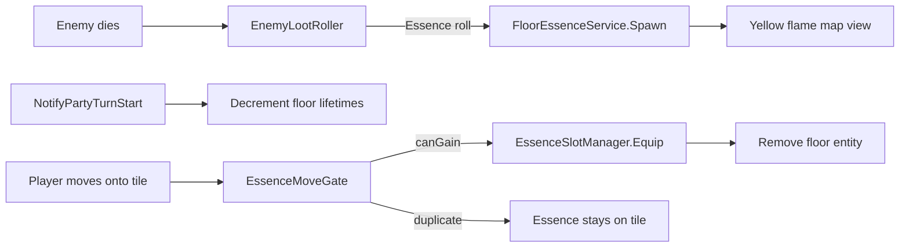

# Enemy essence drops — Requirements

Enemies drop **`EssenceData`** onto the death tile via **`EnemyLootTable`** (DCSS-style independent rolls). Essences are **tiered (1–9)**, appear on the map with a **yellow flame** icon, obey **floor lifetime** rules (most inventory items last forever; essences and some loot despawn), and are acquired through **floor essence pickup** — **not** inventory bags, **not** manual `,` / `g`, and **not** player drop. A party member who **already has the same essence** cannot claim another copy from the floor.

**Depends on:** `EssenceData`, `EssenceSlotManager`, `EnemySpeciesDefinition`, `EnemyLootTable`, `EnemyLootService`, `EnemyLootRoller`, `TurnManager.NotifyPartyTurnStart`, [Enemy death loot & mana stones](../Combat/Enemy-Death-Loot-And-Mana-Stones-Requirements.md), [Sudden Strength Essence](Sudden-Strength-Essence-Requirements.md), [Sudden Strength — Skeleton drop & floor pickup](Sudden-Strength-Skeleton-Drop-And-Floor-Pickup-Requirements.md) (move-gated pickup UX), [Floor item piles](../Inventory/Floor-Item-Pile-Requirements.md), [Auto-pickup confirmation](../Inventory/Auto-Pickup-Confirmation-Requirements.md).

**Related:** [Telekinesis Essence](Telekinesis-Essence-Requirements.md) (must not target floor essences). [Mana stone tiers](../Combat/Enemy-Death-Loot-And-Mana-Stones-Requirements.md) (same **9 = lowest** convention).

**Explicitly out of scope (v0):** Trading essences, essence piles spanning tiles, enemies picking up essences, save/load of unclaimed floor essences, dropping essences to the floor from equipment UI.

---

## 1. Goals

| ID | Goal |
|----|------|
| **G1** | Every essence has a **tier 1–9** on `EssenceData` (DCSS: **1 = highest**, **9 = lowest**; default **9**). |
| **G2** | Enemies spawn **floor essences** from loot tables (`LootTablePayload.Essence`). |
| **G3** | **Floor lifetime** — configurable despawn after N **player phases** from spawn; **0** = never despawn. Pickup **clears** lifetime permanently. |
| **G4** | Essences are **floor-only** — no inventory storage, no manual floor-item menu, **cannot be dropped** by the player. |
| **G5** | **Duplicate block** — a party member who already has **that exact** `EssenceData` cannot acquire it from the floor. |
| **G6** | **v0 content** — **Skeleton** (`speciesId: skeleton`) always drops **Sudden Strength** (tier **9**); **Giant Skeleton** does not. |
| **G7** | **Map icon** — yellow flame sprite shipped under `Assets/Art/Essence/` (§12). |
| **G8** | **SampleScene QA** — `Party_Barbarian_Warrior` pre-equipped with Sudden Strength; skeleton drop must **not** be claimable by him (duplicate rule). |

---

## 2. Glossary

| Term | Meaning |
|------|--------|
| **Essence tier** | Integer **1–9** on `EssenceData`. **1** = best / rarest band; **9** = common / weakest (matches mana stone doc). |
| **Floor essence** | World entity on a tile referencing one `EssenceData` — not `ItemInstance` / bag item. |
| **Exact essence** | Same **`EssenceData` ScriptableObject reference** already in any slot on that actor’s `EssenceSlotManager`. |
| **Player phase** | Party turn cycle boundary at `TurnManager.NotifyPartyTurnStart()` (`--- New Player Turn ---`). |
| **Floor lifetime** | Countdown in **player phases** until an unclaimed map entity is removed; starts when spawned. |
| **Claimed** | Essence equipped via floor pickup, or inventory item picked up — lifetime no longer applies. |

---

## 3. Essence tiers — `EssenceData` (required change)

### R3.1 — New fields

| Field | Type | Default | Notes |
|-------|------|---------|--------|
| **`tier`** | `int` | **9** | Clamped **1–9** in editor and runtime. |
| **`mapIcon`** | `Sprite` | `Essence_MapIcon_YellowFlame` | Floor / minimap presentation (§12). |
| **`floorLifetimePlayerPhases`** | `int` | **10** | Essence floor entity despawn unless claimed (§5). |

### R3.2 — Authoring rules

- **All** essence assets must set `tier` explicitly for new content; unset assets inherit default **9** after code change.
- Display: logs and pickup dialog may show `Tier {tier}` when useful (optional v0).
- **Sudden Strength** v0: **`tier = 9`**.

### R3.3 — Code touchpoint

```csharp
// EssenceData.cs — illustrative
[Range(1, 9)] public int tier = 9;
public Sprite mapIcon;
[Min(0)] public int floorLifetimePlayerPhases = 10;
```

---

## 4. Enemy loot — essence payload

### R4.1 — `LootTablePayload` extension

```csharp
enum LootTablePayload
{
    ManaStone,
    ItemData,
    Essence   // NEW
}
```

| `LootTableEntry` field | When payload = Essence |
|------------------------|-------------------------|
| **`essenceData`** | Required `EssenceData` reference |
| **`dropChance`** | Independent roll `0…1` |
| **`quantity`** | **1** (v0) |

### R4.2 — Spawn pipeline

On successful Essence roll in `EnemyLootRoller` / `EnemyLootService`:

1. Call `FloorEssenceService.SpawnEssence(deathTile, essenceData)` (§6).
2. **Do not** create `ItemInstance` or `FloorItemPileService.AddEntry` for essences.

### R4.3 — v0 — Skeleton → Sudden Strength

| Species | `speciesId` | Essence drop |
|---------|-------------|--------------|
| **Skeleton** | `skeleton` | **Sudden Strength** — `dropChance = 1.0` |
| **Giant Skeleton** | `giant_skeleton` | **None** (v0) |

**Asset wiring:**

| Asset | Requirement |
|-------|-------------|
| `EssenceData` | `Assets/Resources/Item/Essence/SuddenStrength.asset` — `tier = 9`, `mapIcon` → yellow flame |
| `EnemyLootTable_Skeleton` | New row: payload **Essence**, `essenceData` = Sudden Strength, **100%** |
| `EnemyLootTable_GiantSkeleton` | **No** Sudden Strength row |

Death tile = skeleton anchor `GridPosition` (same as [enemy death loot](../Combat/Enemy-Death-Loot-And-Mana-Stones-Requirements.md) §4.2). Mana stone rolls on the same table may still apply on the **same tile**.

---

## 5. Floor lifetime — map entities (essences + items)

### R5.1 — Design intent (DCSS-style)

- Most **inventory** floor drops remain until picked up (**lifetime 0**).
- Some drops (e.g. **essences**, future fragile loot) **fade** after N **player phases** if left on the ground.
- Timer starts when the entity is **spawned** on the map (enemy death, trap drop, etc.).
- Once the player **claims** the entity, it **never** despawns from lifetime again — even if later dropped from inventory (essences cannot be dropped; see §7).

### R5.2 — `ItemData` (inventory floor items)

| Field | Type | Default | Meaning |
|-------|------|---------|--------|
| **`floorLifetimePlayerPhases`** | `int` | **0** | **0** = indefinite on floor; **> 0** = despawn after N player phases unclaimed |

Applies to `WorldItem` / `FloorItemPileService` entries created from that `ItemData`.

### R5.3 — Floor essences

Use **`EssenceData.floorLifetimePlayerPhases`** (default **10**). Initialized on `FloorEssenceService.SpawnEssence`.

### R5.4 — Tick rules

At each **`TurnManager.NotifyPartyTurnStart()`**:

1. For each floor essence: `phasesRemaining--`; at **0** remove entity + view; log `[Essence] {name} faded from {tile}.`
2. For each floor **item** with `phasesRemaining > 0`: same decrement and removal.

**R5.4.1** The spawn phase does **not** consume a tick; first decrement at the **next** player phase start.

**R5.4.2** Entering the tile without claiming does **not** pause the timer.

### R5.5 — On pickup / claim

| Entity | On claim |
|--------|----------|
| **Inventory item** | `ItemInstance` has no floor lifetime; removed from floor service |
| **Floor essence** | Equipped via `EssenceSlotManager`; removed from `FloorEssenceService` |

**R5.5.1** Re-dropping a normal item in a future “drop item” feature uses **`ItemData.floorLifetimePlayerPhases`** fresh from the new spawn — out of scope for essences (§7).

---

## 6. Floor essence service

See [Sudden-Strength-Skeleton-Drop-And-Floor-Pickup-Requirements.md](Sudden-Strength-Skeleton-Drop-And-Floor-Pickup-Requirements.md) §5.3 for API detail. Summary:

| Field | Purpose |
|-------|---------|
| `tile` | `Vector3Int` |
| `essenceData` | Reference + tier + icon from data |
| `phasesRemaining` | From `essenceData.floorLifetimePlayerPhases` at spawn |

**Presentation:** `WorldEssenceView` (or equivalent) uses **`essenceData.mapIcon`** (yellow flame v0).

**v0:** At most **one** floor essence per tile.

---

## 7. Essences cannot be dropped

| Rule | Requirement |
|------|-------------|
| **D1** | No UI or command to place an equipped essence on the floor. |
| **D2** | `EssenceSlotManager` has **no** `DropEssence` / unequip-to-tile path in v0. |
| **D3** | Essences are **never** `ItemInstance` with `StorageLocation.Carried`. |
| **D4** | `InventoryManager` rejects essence-as-item if misconfigured. |
| **D5** | Manual `PickupFloorItems` (`,` / `g`) **ignores** floor essences. |
| **D6** | [Telekinesis](Telekinesis-Essence-Requirements.md) valid targets **exclude** floor essences. |

---

## 8. Duplicate essence — pickup eligibility

### R8.1 — Per party member (not party-wide)

Evaluate for the **mover** who would claim the essence (step onto tile or future explicit interact):

```text
canGain = !HasExactEssence(essenceData) && HasFreeEssenceSlot()
```

| Helper | Definition |
|--------|------------|
| **`HasExactEssence`** | Any equipped slot holds the **same** `EssenceData` reference. |
| **`HasFreeEssenceSlot`** | Occupied slots &lt; `EssenceSlotManager.totalSlots`. |

### R8.2 — UX (move-gated v0)

Detailed dialog copy and move gate: [Sudden-Strength-Skeleton-Drop-And-Floor-Pickup-Requirements.md](Sudden-Strength-Skeleton-Drop-And-Floor-Pickup-Requirements.md) §6.

**Template B (already has essence):**

```text
{moverName} is about to enter a tile with {essenceName}. Entering the tile will not grant {essenceName} because you already have this essence.
```

**R8.2.1** **Yes** still completes the move; essence **remains** on the tile until despawn or another member claims it.

**R8.2.2** **No** — cancel move; no turn spent.

### R8.3 — SampleScene acceptance (locked)

| Actor | Pre-equipped | Skeleton drops Sudden Strength | Expected |
|-------|----------------|-------------------------------|----------|
| **`Party_Barbarian_Warrior`** | Sudden Strength in essence slot 0 | Yes | **Cannot** `canGain`; dialog reason **already have this essence** |
| **Other party members** without Sudden Strength | — | Yes | May `canGain` if free slot |

Scene reference: `SampleScene` — `Party_Barbarian_Warrior.equippedEssences[0]` → `SuddenStrength.asset`.

---

## 9. Integration summary



| Component | Change |
|-----------|--------|
| `EssenceData` | `tier`, `mapIcon`, `floorLifetimePlayerPhases` |
| `ItemData` | `floorLifetimePlayerPhases` (default 0) |
| `LootTablePayload` / entries | `Essence` |
| `EnemyLootRoller` / `EnemyLootService` | Spawn floor essence |
| `FloorEssenceService` | New |
| `FloorLifetimeTicker` | Tick essences + timed items on player phase |
| `EssenceMoveGate` + confirm UI | Per skeleton pickup doc |
| `EssenceSlotManager` | `HasEssence`, `TryAcquireEssence`, no drop |
| `EnemyLootTable_Skeleton` | 100% Sudden Strength |
| `SuddenStrength.asset` | `tier = 9`, `mapIcon` assigned |

---

## 10. Acceptance criteria

| # | Criterion |
|---|-----------|
| **AC1** | `EssenceData.tier` exists; default **9**; Sudden Strength authored as tier **9**. |
| **AC2** | Skeleton death spawns floor Sudden Strength at 100%; giant skeleton does not. |
| **AC3** | Floor essence shows **yellow flame** icon from `mapIcon`. |
| **AC4** | Unclaimed Sudden Strength removed after **10** player phases. |
| **AC5** | `Party_Barbarian_Warrior` cannot gain skeleton-dropped Sudden Strength (duplicate). |
| **AC6** | Another party member with a free slot and without Sudden Strength can gain it. |
| **AC7** | Essence cannot enter inventory or be dropped from slots. |
| **AC8** | Normal floor items with `floorLifetimePlayerPhases = 0` do not despawn. |

---

## 11. Implementation checklist

- [x] `EssenceData`: `tier`, `mapIcon`, `floorLifetimePlayerPhases`
- [x] `ItemData`: `floorLifetimePlayerPhases` (optional v0 if only essences ship first)
- [x] `LootTablePayload.Essence` + skeleton table row
- [x] `FloorEssenceService` + world view + lifetime tick
- [x] Move gate + dialog ([skeleton pickup doc](Sudden-Strength-Skeleton-Drop-And-Floor-Pickup-Requirements.md))
- [x] `EssenceSlotManager` helpers; block drop
- [x] Wire `SuddenStrength.asset` tier + icon
- [x] Unit / play tests AC1–AC8

---

## 12. Art assets (delivered)

| Asset | Path | License |
|-------|------|---------|
| Source | `Assets/Art/Essence/ThirdParty/ElementalShrines/originals/fire_shrine.png` | CC0 — [Elemental Stones/Shrines](https://opengameart.org/content/elemental-stonesshrines-pixel-art) |
| Shipped icon | `Assets/Art/Essence/Sprites/Essence_MapIcon_YellowFlame.png` | 32×32 yellow/orange flame shrine (v0 essence map icon) |
| Attribution | `Assets/Art/Essence/ThirdParty/ElementalShrines/README.md` | |

**Import:** PPU **32**, Point filter, pivot center.

**Authoring:** Assign `mapIcon` on each `EssenceData`; v0 Sudden Strength references `Essence_MapIcon_YellowFlame`.

---

## 13. Traceability

| Product request | Section |
|-----------------|---------|
| Yellow flame essence image | §12, `EssenceData.mapIcon` |
| Tiers 1–9, 1 highest, default 9 | §3 |
| Sudden Strength tier 9, Skeleton drop | §4.3 |
| Items despawn after N turns unless picked up | §5 |
| Essences cannot be dropped | §7 |
| Cannot pick up duplicate essence | §8 |
| Barbarian in SampleScene already has Sudden Strength | §8.3 |
