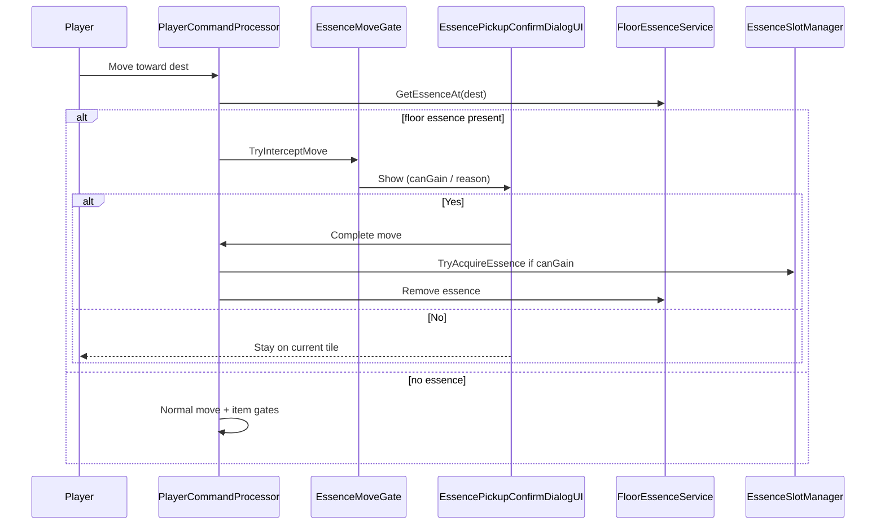

# Sudden Strength — Skeleton drop & floor essence pickup — Requirements

**Implementation detail** for v0 Skeleton → Sudden Strength floor pickup. Parent spec: [Enemy essence drops](Enemy-Essence-Drops-Requirements.md) (tiers, art, floor lifetime, duplicate rules, cannot drop).

**Skeleton** enemies (`speciesId: skeleton`, **not** `giant_skeleton`) always drop the **Sudden Strength** essence (tier **9**) onto the death tile. Essences exist only as **floor objects** — they **cannot** be stored in inventory, picked up with `,` / `g`, or moved via bag UI. When a party member **attempts to enter** a tile that holds an essence, a **move confirmation dialog** runs first (same UX family as [auto-pickup confirmation](../Inventory/Auto-Pickup-Confirmation-Requirements.md)). On **Yes**, the move completes and the mover may **immediately equip** the essence if eligible. Essence pickup does **not** consume an extra action beyond the move. If unclaimed, the floor essence **despawns after 10 player phases**.

**Depends on:** `EnemySpeciesDefinition`, `EnemyLootTable`, `EnemyLootService`, `EnemyLootRoller`, `EnemyController.Die`, `EssenceData`, `EssenceSlotManager`, `PlayerCommandProcessor`, `AutoPickupMoveGate` / `AutoPickupConfirmDialogUI` (pattern reference), `TurnManager.NotifyPartyTurnStart`, [Sudden Strength Essence](Sudden-Strength-Essence-Requirements.md) (essence asset), [Enemy death loot & mana stones](../Combat/Enemy-Death-Loot-And-Mana-Stones-Requirements.md), [Auto-pickup confirmation](../Inventory/Auto-Pickup-Confirmation-Requirements.md).

**Related:** [Telekinesis Essence](Telekinesis-Essence-Requirements.md) (must not pull floor essences). [Floor pickup & auto-pickup](../Inventory/Floor-Pickup-And-Auto-Pickup-Requirements.md) (manual pickup scope).

**Explicitly out of scope (v0):** Dropping essences from inventory, trading essences, essence piles on multi-tile footprints, enemy AI picking up essences, save/load of unclaimed floor essences.

---

## 1. Goals

**G1 — Skeleton content**  
Every **normal Skeleton** death spawns **Sudden Strength** on the death tile with **100%** probability (in addition to existing skeleton loot rolls unless content is later consolidated).

**G2 — Floor-only essence**  
Essences on the ground are **not** `ItemInstance` / `ItemData` inventory items. No bag, no manual floor-item menu, no encumbrance.

**G3 — Move-gated confirmation**  
Before entering a tile with a floor essence, show a blocking dialog naming the **essence** and whether the **mover** will **gain** it or **not**.

**G4 — Immediate equip on enter**  
After **Yes**, if the mover **does not already have that exact essence** and has a **free essence slot**, equip into the first empty slot and remove the floor essence.

**G5 — Timed despawn**  
Unclaimed floor essences are removed after **10 player phases** on the tile (§2).

**G6 — No extra turn cost**  
Gaining an essence does not call `OnPlayerActionComplete` again; the **move** already ends the actor’s action as today.

---

## 2. Glossary

| Term | Meaning |
|------|--------|
| **Skeleton** | Enemy with `EnemySpeciesDefinition.speciesId == "skeleton"` and loot table **`EnemyLootTable_Skeleton`** — **excludes** `giant_skeleton`. |
| **Floor essence** | A world pickup entity referencing one **`EssenceData`** asset on a `Vector3Int` tile — **not** inventory. |
| **Exact essence** | Same **`EssenceData`** reference (ScriptableObject identity) already equipped in any slot on that actor’s `EssenceSlotManager`. |
| **Maximum essences** | `EssenceSlotManager.totalSlots` (v0 default **3**); **occupied** = non-null entry in `equippedEssences`. |
| **Free essence slot** | Lowest index `i` where `GetEssenceInSlot(i) == null` and `i < totalSlots`. |
| **Player phase** | Same as [Sudden Strength Essence](Sudden-Strength-Essence-Requirements.md) §2: boundary at `TurnManager.NotifyPartyTurnStart()`. |
| **Despawn tick** | One decrement of floor essence `turnsUntilDespawn` per player phase while the essence remains on the tile. |

---

## 3. Current baseline (as-is)

| Area | Today |
|------|--------|
| **Skeleton loot** | `EnemyLootTable_Skeleton`: mana stone entries only (T9 rolls). |
| **Giant skeleton loot** | Separate table; **no** Sudden Strength requirement. |
| **Loot payloads** | `LootTablePayload`: `ManaStone`, `ItemData` only. |
| **Death spawn** | `EnemyLootService` → `EnemyLootRoller` → `FloorItemPileService.AddEntry` for `ItemInstance`. |
| **Essence on actor** | `EssenceSlotManager.EquipEssence` / `totalSlots`. |
| **Move confirm (items)** | `AutoPickupMoveGate` + `AutoPickupConfirmDialogUI` for confirm-gated **items**. |
| **Floor essences** | **Not implemented**. |

---

## 4. Skeleton loot — Sudden Strength (100%)

### R4.1 — Species scope

| Species | `speciesId` | Sudden Strength drop |
|---------|-------------|------------------------|
| Skeleton | `skeleton` | **Required** — 100% on death |
| Giant Skeleton | `giant_skeleton` | **Must not** drop Sudden Strength (v0) |

### R4.2 — Loot table authoring

Add to **`EnemyLootTable_Skeleton`** (`Assets/Data/Enemy/Loot/EnemyLootTable_Skeleton.asset`):

| Field | Value |
|-------|--------|
| **Payload** | New `LootTablePayload.Essence` (§5.1) |
| **`dropChance`** | **1.0** (100%) |
| **`essenceData`** | Reference to **`Sudden Strength`** `EssenceData` asset ([Sudden-Strength-Essence-Requirements.md](Sudden-Strength-Essence-Requirements.md) §4.1) |
| **`quantity`** | **1** |

**R4.2.1** Roll is **independent** of other entries (existing mana stone rows remain unless content team removes them).

**R4.2.2** **`EnemyLootTable_GiantSkeleton`** must **not** include a Sudden Strength essence entry in v0.

### R4.3 — Death spawn location

Same as [enemy death loot](../Combat/Enemy-Death-Loot-And-Mana-Stones-Requirements.md) §4.2: skeleton **anchor** `GridPosition`. Multiple drops (mana stones + essence) may coexist on the **same tile** as separate floor entities.

---

## 5. Data model — loot & floor essence

### D5.1 — `LootTablePayload` extension

```csharp
enum LootTablePayload
{
    ManaStone,
    ItemData,
    Essence   // NEW
}
```

### D5.2 — `LootTableEntry` (add field)

| Field | When payload = Essence |
|-------|-------------------------|
| **`essenceData`** | `EssenceData` reference (required) |

`EnemyLootRoller` / `EnemyLootService`: on successful Essence roll, spawn a **floor essence** (§5.3), **not** `FloorItemPileService.AddEntry` for an `ItemInstance`.

### D5.3 — `FloorEssenceEntry` + `FloorEssenceService`

New runtime service (name illustrative):

| Field | Purpose |
|-------|---------|
| **`entryId`** | Stable id for views / removal |
| **`tile`** | `Vector3Int` |
| **`essenceData`** | `EssenceData` reference |
| **`turnsUntilDespawn`** | Initialized to **10** on spawn |

**API (minimum):**

- `SpawnEssence(Vector3Int tile, EssenceData data)` → creates entry, `turnsUntilDespawn = 10`, spawns world view.
- `GetEssenceAt(Vector3Int tile)` → single entry or null (v0: **at most one** floor essence per tile).
- `RemoveEssence(string entryId)` / `RemoveAtTile(tile)`.
- `TickDespawnAll()` — called from `TurnManager.NotifyPartyTurnStart()` (§7.3).

**World presentation:** distinct visual from item piles (icon from `EssenceData` or dedicated floor-essence prefab); **not** using `ItemData` / inventory row UI.

### D5.4 — Not inventory

| Rule | Requirement |
|------|-------------|
| **N1** | Floor essences are **never** `ItemInstance` with `StorageLocation.Carried`. |
| **N2** | `InventoryManager.AddItem` **rejects** any future mistaken `ItemData` wrapper for essences. |
| **N3** | `FloorPickupMenuUI` / manual `,` / `g` **ignore** floor essences. |
| **N4** | [Telekinesis](Telekinesis-Essence-Requirements.md) valid targets **exclude** floor essences. |
| **N5** | Essences cannot be **dropped** from inventory UI (no inventory path). |

---

## 6. Move confirmation dialog

### F6.1 — Trigger (before move)

Mirror [auto-pickup confirmation](../Inventory/Auto-Pickup-Confirmation-Requirements.md) §4.1:

1. Player initiates move to **`dest`**.
2. Walkability / bump checks pass (not enemy bump).
3. If `FloorEssenceService.GetEssenceAt(dest) != null` → **block move** and open **`EssencePickupConfirmDialogUI`** (new, or essence mode on shared confirm shell).
4. If no floor essence → existing flow (`AutoPickupMoveGate`, then move).

**R6.1.1 — Ordering when tile has essence + items**  
If **`dest`** has a floor essence **and** confirm-gated auto-pickup **items**:

1. Show **essence** dialog first.
2. On **Yes** → complete move → resolve essence (§6.4) → then run confirm-gated / silent **item** pickup on `dest` per existing specs (mana stones silent via `GridMover.Moved` / `PickupConfirmGatedAt` as today).

**R6.1.2 — Cancel**  
**No** position change; **no** essence grant; **no** turn consumed (same as item move gate).

### F6.2 — Eligibility (for copy + grant)

Evaluate for the **mover** (`BaseActor` who would step onto `dest`):

```text
canGain = !HasExactEssence(essenceData) && HasFreeEssenceSlot()
```

| Helper | Definition |
|--------|------------|
| **`HasExactEssence`** | Any equipped slot holds the **same** `EssenceData` reference. |
| **`HasFreeEssenceSlot`** | `CountOccupiedSlots() < totalSlots`. |

**Maximum essences reached** ⇔ `!HasFreeEssenceSlot()` (all slots occupied).

### F6.3 — Dialog copy (required)

Use **`essenceData.essenceName`** in all messages (fallback: asset name if display name empty).

**Template A — will gain ( `canGain == true` )**

```text
{moverName} is about to enter a tile with {essenceName}. Entering the tile will immediately grant {essenceName}.
```

**Template B — will not gain ( `canGain == false` )**

```text
{moverName} is about to enter a tile with {essenceName}. Entering the tile will not grant {essenceName} because {reason}.
```

| Condition | `{reason}` |
|-----------|------------|
| All essence slots full | `you already have the maximum number of essences` |
| Already has exact essence (slots may be free) | `you already have this essence` |

**R6.3.1** UI: dim overlay + Y/N (reuse `AutoPickupConfirmDialogUI` chrome / [Inventory UI redesign](../Inventory/Inventory-UI-Redesign-Requirements.md) confirm pattern).

**R6.3.2** Dialog names the **mover** (active member, or formation leader when applicable — same rule as auto-pickup §4.3).

### F6.4 — On **Yes**

1. Execute pending **move** (`TryMove` / formation rules).
2. Re-query floor essence at **`dest`** (if another actor claimed it same frame, skip grant).
3. If mover still **`canGain`**:
   - `EssenceSlotManager.EquipEssence(essenceData, firstFreeSlotIndex)`.
   - `FloorEssenceService.RemoveAtTile(dest)` (or remove by `entryId`).
   - Log e.g. `[Essence] {moverName} gained {essenceName}.`
4. If mover no longer **`canGain`** (edge case): move still completes; essence **remains** on tile unless despawned.
5. **Do not** call `OnPlayerActionComplete` an extra time — move completion already marked the actor as acted (§6.5).
6. Continue item pickup passes on `dest` if applicable (§6.1.1).

### F6.5 — Turn cost

| Action | Consumes player action? |
|--------|-------------------------|
| Move onto essence tile (after Yes) | **Yes** — existing move completion |
| Essence grant on enter | **No** — side effect of the move |
| Cancel dialog | **No** |

### F6.6 — On **No**

No move; no grant; no despawn tick consumed for that attempt.

---

## 7. Despawn — 10 player phases

### F7.1 — Initialization

On `SpawnEssence`: set **`turnsUntilDespawn = 10`**.

### F7.2 — Tick

At each **`TurnManager.NotifyPartyTurnStart()`** (party-wide hook):

- For each floor essence entry: `turnsUntilDespawn--`.
- When value reaches **0** after decrement: remove entry + world view; log e.g. `[Essence] {essenceName} faded from {tile}.`

**R7.2.1** The spawn phase does **not** consume a tick; first tick occurs at the **next** player phase start (aligned with Sudden Strength buff duration semantics).

**R7.2.2** Despawn is **independent** of whether the tile was entered.

### F7.3 — Grant removes entity

Successful equip (§6.4) removes the floor essence immediately — no further despawn ticks.

---

## 8. `EssenceSlotManager` helpers (required)

Implement on `EssenceSlotManager` (or small static helper used by dialog + pickup):

| Method | Behavior |
|--------|----------|
| `bool HasEssence(EssenceData data)` | True if any slot holds same reference. |
| `bool HasFreeSlot()` | True if occupied count &lt; `totalSlots`. |
| `int GetFirstFreeSlotIndex()` | −1 if none. |
| `bool TryAcquireEssence(EssenceData data)` | If `!HasEssence(data)` and free slot → `EquipEssence(data, index)`; return success. |

**R8.1** Acquiring applies `EssenceData.Apply` via existing `EquipEssence` path.

**R8.2** Duplicate **different** essences in multiple slots allowed; duplicate **same** `EssenceData` forbidden by `canGain`.

---

## 9. Integration summary



| Component | Change |
|-----------|--------|
| `LootTablePayload` / `LootTableEntry` | Essence payload |
| `EnemyLootRoller` / `EnemyLootService` | Spawn floor essence |
| `FloorEssenceService` | New |
| `EssenceMoveGate` | New (parallel to `AutoPickupMoveGate`) |
| `EssencePickupConfirmDialogUI` | New (or shared confirm controller) |
| `PlayerCommandProcessor` | Call essence gate before item gate |
| `TurnManager` | Tick `FloorEssenceService` despawn |
| `EnemyLootTable_Skeleton` | 100% Sudden Strength entry |
| `EssenceSlotManager` | Acquire helpers |

---

## 10. Functional acceptance (F10.x)

**F10.1 — Skeleton drop**  
Given a Skeleton dies, then `FloorEssenceService` has Sudden Strength at death tile (100% in test with fixed RNG).

**F10.2 — Giant skeleton**  
Given Giant Skeleton dies, then no Sudden Strength floor essence spawns.

**F10.3 — Dialog gain path**  
Given mover without Sudden Strength and free slot, when moving onto essence tile, Template A appears; **Yes** → mover has essence equipped, floor entity gone, move consumed, no double action.

**F10.4 — Dialog max slots**  
Given all slots full, Template B with maximum-essences reason; **Yes** → move completes, essence **still on tile**.

**F10.5 — Dialog already owned**  
Given mover already has Sudden Strength, Template B with already-has reason; **Yes** → move completes, no duplicate, essence still on tile.

**F10.6 — Cancel**  
**No** → no move, no grant, no action spent.

**F10.7 — Despawn**  
Given essence unclaimed, after **10** player-phase ticks, essence removed from tile.

**F10.8 — Not inventory**  
Floor essence cannot be added via `InventoryManager` or manual floor item menu.

---

## 11. Tests (recommended)

| Test | Notes |
|------|-------|
| `EnemyLootRoller` skeleton + essence entry | Edit Mode |
| `canGain` / dialog reason selection | Edit Mode |
| Despawn after 10 phase ticks | Edit Mode |
| `TryAcquireEssence` + duplicate block | Edit Mode |
| Move gate cancel vs confirm | Edit Mode / Play Mode |

Update **`EnemyLootRollerTests`**: assert skeleton table includes essence roll; giant skeleton table does not.

---

## 12. Implementation status

| Deliverable | Status |
|-------------|--------|
| `LootTablePayload.Essence` | **Not created** |
| `FloorEssenceService` | **Not created** |
| `EssenceMoveGate` / confirm UI | **Not created** |
| `EnemyLootTable_Skeleton` Sudden Strength row | **Not created** |
| `Sudden Strength` `EssenceData` asset | Per [Sudden-Strength-Essence-Requirements.md](Sudden-Strength-Essence-Requirements.md) |

---

## 13. Traceability to product request

| Request | Section |
|---------|---------|
| Skeleton (not giant) 100% drop Sudden Strength | §4 |
| Confirm dialog with essence **name** | §6.3 |
| Gain if not exact essence + under max slots | §6.2, §6.4, §8 |
| No gain if at max essences (dialog + behavior) | §6.3 Template B |
| Despawn 10 turns after appearing | §7 |
| Gaining essence does not consume a turn | §6.5 |
| Essence cannot be placed in inventory | §5.4 |
