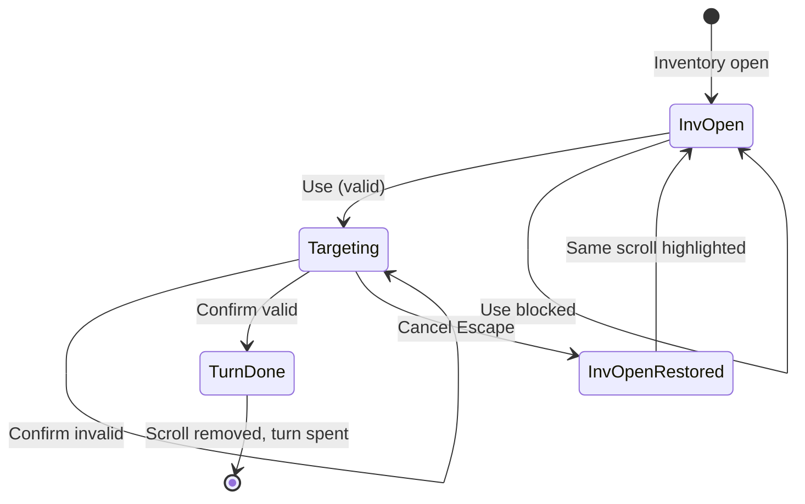

# Fireball Scroll — Requirements (DCSS-style targeted consumable)

A **scroll** item the player **uses from inventory** (like DCSS scrolls / evocables that ask for a target tile). On **Use**, the inventory **closes** and the game enters the existing **targeting reticle** flow. The scroll’s effect is **identical** to the **`Fireball_Standard`** essence ability (`FireballAbility`). **Weight: 1**. v0 includes a **SampleScene**-placeable **`WorldItem`** prefab for pickup testing.

**Depends on:** `ItemData` (`ItemCategory.Scroll`, `weight`, `activeAbilities`), `InventoryUI`, `InventoryUsability`, `InventoryItemUse`, `InventoryConsumePolicy`, `PlayerCommandProcessor`, `InputHandler`, `InputState.Targeting`, `TargetingReticleView`, `FireballAbility` / `Fireball_Standard.asset`, `AbilityAction.Execute(user, targetTile)`, `TurnManager` (`CanActorTakeAction`, `OnPlayerActionComplete`), `InventoryManager.TryRemoveCarried`, `WorldItem`, [Inventory UI redesign](Inventory-UI-Redesign-Requirements.md), [Telekinesis essence](../Essence/Telekinesis-Essence-Requirements.md) (targeting / invalid-confirm patterns).

**Related:** `Assets/Resources/Item/Ability/Fireball_Standard.asset` — `requiresTarget: 1`, `splashRadius: 2`, `fireDamage: 15`, `soulPowerCost: 0`, `noiseVolume: 35`, `noiseOriginAtTargetTile: 1`.

**Explicitly out of scope (v0):** Scroll identification / curse / read failure; multi-quantity scroll stacks UI; ally-using scroll in combat policy beyond existing `InventoryUsability`; scroll shops; procedural scroll drops; save/load scroll targeting session; recharging / noise propagation changes to fireball.

**Product approval (art):** **Option A** — DCSS `i-immolation.png` (2026-05-25). **Not imported** until implementation milestone.

---

## 1. Goals

**G1 — DCSS-style use flow**  
Player selects **Use** on a carried scroll → inventory **closes** → **targeting mode** → confirm or cancel.

**G2 — Same effect as essence fireball**  
Successful confirm runs the **same** `FireballAbility` logic and authored fields as **`Fireball_Standard`** (shared ability asset reference, not a duplicate implementation).

**G3 — Cancel is free**  
**Escape** (existing **CancelTarget** binding) **does not** consume the scroll, **does not** end the player’s turn, and **reopens** inventory with the **same scroll row highlighted**.

**G4 — Confirm consumes**  
Valid confirm **executes fireball**, **removes** the scroll instance from inventory, **destroys** the consumed `ItemInstance` / stack entry, and **consumes the active member’s player action** (same as essence fireball confirm today).

**G5 — Weight**  
`ItemData.weight = **1**`.

**G6 — SampleScene QA**  
Author **`Scroll_Fireball`** `ItemData` + **`WorldItem_Scroll_Fireball`** prefab; designer can **drag** prefab into **SampleScene** for pickup and full use loop.

**G7 — Debug traceability**  
Structured **`Debug.Log`** / **`Debug.LogWarning`** at each decision point (§10) with a shared prefix **`[Scroll:Fireball]`**.

---

## 2. Glossary

| Term | Meaning |
|------|--------|
| **Scroll row** | `InventoryViewModel.Row` for the fireball scroll at use time. |
| **Pending scroll use** | Runtime state between closing inventory and confirm/cancel (ability ref + owner + instance id + saved list selection). |
| **Valid target** | Reticle tile where `FireballAbility.Execute(user, targetTile)` returns **true** (v0: same rules as essence — no extra scroll-only validation unless fireball gains range checks later). |
| **Invalid confirm** | Confirm on a tile where execute returns **false** — scroll **not** consumed, turn **not** spent, targeting **stays** open (match Telekinesis invalid-target pattern). |
| **Cancel** | `PlayerCommandKind.CancelTarget` while pending scroll targeting is active. |

---

## 3. Current baseline (as-is)

| Area | Today |
|------|--------|
| **Fireball essence** | `Fireball_Standard` + `FireballAbility`; targeted via `PlayerCommandProcessor` + `EssenceSlotManager.TryExecuteAbility(..., target)`. |
| **Inventory Use** | `InventoryUI.TryUseConsumeStub` → `InventoryItemUse.TryUseCarriedItem` calls `ability.Execute(user)` **without** target → fireball **fails** (`ExecuteCore` logs and returns false). |
| **On “success”** | `InventoryItemUse` immediately `TryRemoveCarried` — wrong for multi-step targeted scrolls. |
| **Targeting source** | `PlayerAbilitySource` only **Essence** and **EquipmentItem** — **no inventory scroll source**. |
| **Inventory blocks input** | `InventoryUI.BlocksGameplay` while panel active — must **close** panel before reticle receives grid input. |
| **Scroll category** | `InventoryUsability` treats **Scroll** like **Potion** (usable when owner present; combat rules via `InventoryPolicy`). |
| **World pickup** | `WorldItem_Potion` prefab pattern: `WorldItem` + `SpriteRenderer` + `ItemData` reference. |

---

## 4. Content authoring

### D4.1 — `ItemData` — `Scroll_Fireball` (name flexible)

| Field | Requirement |
|-------|-------------|
| **`itemName`** | e.g. `Scroll of Fireball` |
| **`category`** | `ItemCategory.Scroll` |
| **`weight`** | **1** |
| **`autoPickupOnStep`** | Designer choice (v0 SampleScene: **false** or **true** — document in scene note; default **false** to avoid accidental pickup during trap tests). |
| **`icon`** | Unity sprite from **Option A** art (§12) — DCSS `i-immolation` → `Scroll_Fireball.png` |
| **`activeAbilities`** | Single entry: reference **`Fireball_Standard`** asset (same GUID as essence), **not** a copy-pasted duplicate ability. |
| **`goldValue`** | Optional (e.g. 50) |

**Suggested paths:**

- `Assets/Resources/Item/Scroll/Scroll_Fireball.asset`
- Icon: `Assets/Art/Items/Sprites/Scroll_Fireball.png` (after art import §12)

### D4.2 — Ability reference

| Rule | Detail |
|------|--------|
| **Shared ability** | `activeAbilities[0]` → `Assets/Resources/Item/Ability/Fireball_Standard.asset` |
| **Soul Power** | Scroll use **does not** charge SP (`soulPowerCost` already **0** on asset). |
| **Targeting** | Inherited: `requiresTarget = true`, `splashRadius = 2`, `fireDamage = 15`, etc. |

### D4.3 — `WorldItem_Scroll_Fireball` prefab

Mirror **`WorldItem_Potion`**:

| Component | Requirement |
|-----------|-------------|
| **`WorldItem`** | `data` → `Scroll_Fireball` asset |
| **`SpriteRenderer`** | Uses `Scroll_Fireball.icon` at runtime (`WorldItem.Start`) |
| **Collider** | Same as potion prefab (pickup interaction) |
| **Scale** | Match potion world scale (0.5, 0.5, 1) unless art readability needs tweak |

**Suggested path:** `Assets/Prefabs/Item/WorldItem_Scroll_Fireball.prefab`

### D4.4 — SampleScene placement

- Place one or more **`WorldItem_Scroll_Fireball`** instances on walkable floor near player spawn.
- Optional: pre-seed one scroll in a test member’s `InventoryManager` via scene/debug hook (out of spec if not already used elsewhere).

---

## 5. Player flow

### F5.1 — Preconditions (Use)

1. Inventory **open**; player highlights **Scroll of Fireball** row.
2. Player triggers **Use** (existing inventory action binding).
3. Checks (existing + scroll-specific):
   - `InventoryUsability.AppearsUsableNow(row, inCombat)` **true**
   - `InventoryConsumePolicy.CanConsume(row, out reason)` **true**
   - Active member / owner valid; item **carried** (not on ground)
   - `TurnManager.CanActorTakeAction(activeMember)` **true** (scroll use spends a turn **only** on successful confirm — but activation should be blocked if member already acted, same as ability hotkeys)
   - `GameState.PLAYER_TURN` (same gate as `PlayerCommandProcessor`)

If any check fails → log **`[Scroll:Fireball] Use blocked: {reason}`**; inventory **stays open**.

### F5.2 — Start targeting (Use accepted)

1. Capture **resume context**: list index / `ItemInstance` id / `ItemData` reference / owning `BaseActor`.
2. **Close** inventory panel (`inventoryPanel.SetActive(false)`), call `SaveInventorySessionState()` so selection index is persisted.
3. Do **not** remove scroll yet.
4. Enter targeting via **`PlayerCommandProcessor`** (new path §6) with **`Fireball_Standard`** and **scroll pending state**.
5. Show reticle at **active member** `GridPosition` (same as essence).
6. Log: **`[Scroll:Fireball] Use started; inventory closed; targeting active.`**

### F5.3 — Targeting (reticle)

| Input | Behavior |
|-------|----------|
| **Grid move** | Moves reticle (`TargetingReticleView.Move`) — same as essence targeting. |
| **Confirm** | §5.4 |
| **Cancel (Escape)** | §5.5 |

`InventoryUI.BlocksGameplay` must be **false** during reticle (panel closed).

### F5.4 — Confirm

1. Read `targetTile = reticleView.Position`.
2. Call `FireballAbility.Execute(activeMember.gameObject, targetTile)` (or shared wrapper — **must** use targeted overload so noise uses `noiseOriginAtTargetTile`).
3. **If execute returns false** (invalid target / failed core):
   - Log **`[Scroll:Fireball] Confirm rejected at {targetTile}.`**
   - **Remain** in targeting; **do not** consume scroll or turn.
4. **If execute returns true**:
   - `InventoryManager.TryRemoveCarried(instance)` for the **pending** instance.
   - Exit targeting.
   - `TurnManager.OnPlayerActionComplete(activeMember)` (or formation path matching `ApplyConfirmTarget` for essence).
   - Log **`[Scroll:Fireball] Confirm success at {targetTile}; scroll consumed; turn ended.`**
   - **Do not** auto-reopen inventory (player reopens with **i** when desired).

### F5.5 — Cancel

1. Exit targeting (clear pending scroll state).
2. **Do not** remove scroll; **do not** call `OnPlayerActionComplete`.
3. **Reopen** inventory:
   - `inventoryPanel.SetActive(true)`
   - Restore **saved selection** to the scroll row index captured in F5.2
   - `RefreshInventoryDisplay()` so highlight matches `_selection`
4. Log: **`[Scroll:Fireball] Cancelled; scroll retained; inventory reopened; selection restored.`**

### F5.6 — Flow diagram



---

## 6. Implementation design (locked)

### D6.1 — Extend targeted-ability pipeline

Add **`PlayerAbilitySource.InventoryScroll`** (or **`CarriedItem`**) to `PlayerCommandProcessor`:

| Field on pending struct | Purpose |
|-------------------------|---------|
| `Source` | `InventoryScroll` |
| `Ability` | `Fireball_Standard` reference |
| `ItemInstance` | Instance to remove on success |
| `InventoryResumeIndex` | List selection to restore on cancel |

**`ApplyConfirmTarget`** branch:

```csharp
PlayerAbilitySource.InventoryScroll =>
    ExecuteScrollFireball(pending, target) // ability.Execute + TryRemoveCarried on success
```

**`ApplyCancelTarget`** branch:

- If pending source is **InventoryScroll** → run §5.5 reopen inventory callback → then `ExitTargetingMode()`.

### D6.2 — Replace `InventoryItemUse` targeted path

| `requiresTarget` | Behavior |
|------------------|----------|
| **false** | Keep today: `Execute(user)` → on success remove + return true |
| **true** | **Do not** execute or remove in `InventoryItemUse`. Return a new outcome e.g. **`InventoryUseResult.StartedTargeting`** so `InventoryUI` closes panel and calls **`PlayerCommandProcessor.BeginInventoryScrollTargeting(...)`** |

`InventoryUI.TryUseConsumeStub` (or renamed `TryUseSelectedItem`) handles the targeting start path and logs.

### D6.3 — Turn and formation

On **successful** scroll confirm, mirror **`ApplyConfirmTarget`** after essence:

- If formation active: `RecordNewLeaderPosition`, `ProcessFollowerRush`, `ForceEndPlayerTurn`
- Else: `OnPlayerActionComplete(activeMember)`

On **cancel**: no turn mutation.

### D6.4 — Input routing

- While **pending inventory scroll targeting**, `InputHandler` must **not** treat **ToggleInventory** as conflicting with cancel unless design says otherwise (v0: **Escape = cancel only**; **i** opens fresh inventory only when not targeting — if targeting, **i** ignored or maps to cancel — **locked: i ignored during scroll targeting**; only **CancelTarget** restores inventory).

### D6.5 — Invalid confirm vs cancel

| Outcome | Scroll | Turn | Inventory |
|---------|--------|------|-----------|
| Invalid confirm | Kept | Not spent | Closed; targeting continues |
| Cancel | Kept | Not spent | Reopened; scroll selected |
| Valid confirm | Removed | Spent | Closed |

---

## 7. Combat and usability

Reuse existing **`InventoryUsability`** scroll rules:

- Not usable when **equipped** (N/A for scrolls).
- Out of combat: usable if `row.Owner != null`.
- In combat: `InventoryPolicy.CanUseCarriedFromAlly(...)`.

No new scroll-specific combat policy in v0.

---

## 8. Acceptance criteria

| ID | Test |
|----|------|
| **AC1** | Pick up `WorldItem_Scroll_Fireball` in SampleScene; item appears in inventory with weight **1**. |
| **AC2** | Use → inventory closes → reticle visible. |
| **AC3** | Cancel → scroll still in inventory → inventory reopens → scroll row highlighted → active member can still act. |
| **AC4** | Confirm on valid tile → fire damage in splash radius → scroll gone → turn advances. |
| **AC5** | Confirm invalid (if fireball returns false) → scroll remains → turn not spent. |
| **AC6** | Console shows **`[Scroll:Fireball]`** logs for start / cancel / success / blocked. |
| **AC7** | Effect matches essence fireball (damage, splash, self-damage, noise at target). |

---

## 9. Implementation checklist (engineering)

**Note:** Checklist is for a **future implementation pass** — not started as of Option A approval.

- [ ] Import **Option A** icon (§12) → assign on `Scroll_Fireball`
- [ ] Create `Scroll_Fireball.asset` + `WorldItem_Scroll_Fireball.prefab`
- [ ] Extend `PlayerAbilitySource` + `PendingTargetedAbility` (or parallel pending scroll state)
- [ ] `PlayerCommandProcessor`: begin / confirm / cancel inventory scroll targeting
- [ ] `InventoryItemUse` + `InventoryUI`: targeted scroll does not eager-consume
- [ ] `InventoryUI.ReopenAfterScrollCancel(selectionIndex)` (or public static helper)
- [ ] Wire **Use** action to new path (replace Phase2 stub logging where needed)
- [ ] Place prefab(s) in SampleScene
- [ ] Play-mode QA for AC1–AC7
- [ ] Unit tests (optional v0): cancel retains item; confirm removes (mock `InventoryManager`)

---

## 10. Debug logging contract

All messages use prefix **`[Scroll:Fireball]`**.

| Event | Level | Example message |
|-------|-------|-----------------|
| Use blocked | Log | `Use blocked: Not enough ...` |
| Use started | Log | `Use started; inventory closed; targeting active.` |
| Confirm rejected | Log | `Confirm rejected at (x,y,z).` |
| Confirm success | Log | `Confirm success at (x,y,z); scroll consumed; turn ended.` |
| Cancel | Log | `Cancelled; scroll retained; inventory reopened; selection restored.` |
| Missing pending state | Warning | `Cancel with no pending scroll state.` |
| Remove failed after execute | Warning | `Execute succeeded but TryRemoveCarried failed for {instanceId}.` |

---

## 11. Art direction (reference)

Scroll icon should read as **paper / parchment** with **fire** or **explosion** cue at **32×32** (match DCSS item tile scale used for hazards/traps pipeline: **PPU 32**, point filter).

---

## 12. Art — DCSS `i-immolation` (Option A, approved)

**Status:** **Approved** (product approval 2026-05-25). **Not imported** — import during implementation (§9 checklist).

| | |
|--|--|
| **Source** | Dungeon Crawl Stone Soup tile pack (`crawl-tiles Oct-5-2010/item/scroll/i-immolation.png`) |
| **Look** | Rolled scroll with **fire / burst** motif — closest DCSS analogue to a fireball scroll |
| **License** | Same as existing hazard art: [OpenGameArt DCSS 32×32](https://opengameart.org/content/dungeon-crawl-32x32-tiles); free use; courtesy link appreciated |
| **Import path** | `Assets/Art/Items/ThirdParty/DungeonCrawl32/originals/i-immolation.png` → `Assets/Art/Items/Sprites/Scroll_Fireball.png` |
| **Unity import** | **PPU 32**, point filter, no compression (match `Assets/Art/Hazards/` pipeline) |
| **Fit** | Consistent with **Lava / poison gas** DCSS imports in repo |

### Declined alternatives (reference only)

| Option | Source | Why not chosen |
|--------|--------|----------------|
| **B** | DCSS `i-identify.png` / `blank_paper.png` | Generic scroll; weak fireball read |
| **C** | [32rogues](https://sethbb.itch.io/32rogues) | Different palette from DCSS hazards |
| **D** | [Ever Rogue](https://efilheim.itch.io/ever-rogue) CC0 | 16×16; scale mismatch with 32×32 items |

---

## 13. Document history

| Date | Note |
|------|------|
| 2026-05-25 | Initial requirements; art options A–D presented |
| 2026-05-25 | **Option A approved** (DCSS `i-immolation`); implementation deferred |
