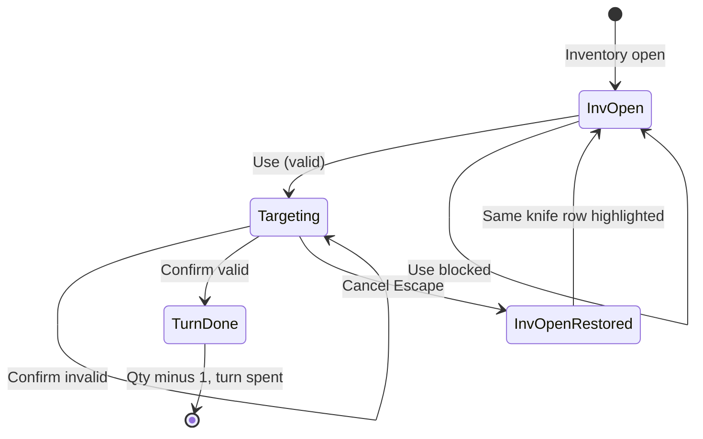

# Throwing Knife — Requirements (DCSS-style targeted consumable missile)

A **missile** item the player **uses from inventory** (same flow as the [Fireball Scroll](Fireball-Scroll-Requirements.md): **Use** → inventory **closes** → **targeting reticle** → confirm or cancel). On **successful throw**, the knife deals damage **only** to battle targets **on the selected tile** (no splash). The player may carry **many knives in one stack** (`ItemInstance.quantity`); each successful throw consumes **one** knife and leaves the rest usable. A successful throw **ends the active party member’s action** for that turn. v0 includes content assets so the knife can be **seeded on the player** and placed in **SampleScene** for pickup QA.

**Depends on:** `ItemData` (`ItemCategory.Missile`, `weight`, `activeAbilities`, `inventoryTargetedUseLogTag`), `ItemInstance.Quantity`, `InventoryUI`, `InventoryUsability`, `InventoryItemUse`, `InventoryConsumePolicy`, `PlayerCommandProcessor.TryBeginInventoryTargetedUse` / `PlayerAbilitySource.InventoryItem`, `InputHandler`, `InputState.Targeting`, `TargetingReticleView`, `AbilityAction.Execute(user, targetTile)`, `TargetingResolver`, `TurnManager`, `InventoryManager`, `WorldItem`, [Fireball Scroll](Fireball-Scroll-Requirements.md) (inventory targeted-use pattern), [Inventory UI redesign](Inventory-UI-Redesign-Requirements.md), [Multi-tile enemies](../Combat/Multi-Tile-Enemy-Requirements.md) (footprint occupancy on a tile).

**Related (today):** Fireball scroll pipeline is **implemented** (`InventoryItemUse` → `InventoryUseResult.StartedTargeting` → `PlayerCommandProcessor` confirm/cancel). Fireball uses `FireballAbility` + `splashRadius: 2`. Throwing knife needs a **new** single-tile ability asset.

**Explicitly out of scope (v0):** Throwing skill / to-hit rolls; line-of-sight and max-range enforcement (fields may be authored for a later pass); quiver UI; equipping knives as melee weapons; knife identification / curse; returning knives; animation flight path (instant hit on confirm); ally-only or enemy-only filtering beyond a simple `canHurtAllies` flag; shops and procedural drops; save/load mid-targeting session; stacked icon variant in list row (quantity `×N` text is enough).

**Product approval (art):** **Option A** — Idylwild `throwingknife1.png` (2026-05-29). **Icon imported** at `Assets/Art/Items/Sprites/Missile_ThrowingKnife.png`; gameplay implementation still deferred (§9).

---

## 1. Goals

**G1 — Same inventory targeting flow as Fireball Scroll**  
**Use** on a carried throwing knife → inventory **closes** → **targeting mode** → confirm or cancel.

**G2 — Single-tile damage only**  
On confirm, apply damage **only** to `IBattleTarget` actors whose footprint **includes** the reticle tile. **No** splash to neighboring tiles (`splashRadius = 0`).

**G3 — Cancel is free**  
**Escape** (`CancelTarget`) does **not** consume a knife, does **not** end the turn, and **reopens** inventory with the **same row** highlighted (same as scroll).

**G4 — Successful throw consumes one knife and the turn**  
Valid confirm: execute knife ability, **decrement stack by 1** (or remove the `ItemInstance` when quantity reaches 0), and **consume the active member’s player action** (same as scroll / essence targeted confirm).

**G5 — Multiple knives in one stack**  
Designer/player inventory uses **one** `ItemInstance` with `quantity > 1` (e.g. 5 knives). After one throw, inventory shows **quantity − 1**; the row remains until quantity is 0. Other knives are available on later turns.

**G6 — Weight**  
Per-knife catalog weight **`ItemData.weight = 0.1`** (five knives in one stack weigh **0.5** total toward encumbrance).

**G7 — Player inventory & SampleScene QA**  
Ship **`Missile_ThrowingKnife`** `ItemData`, **`ThrowingKnife_Standard`** ability, **`WorldItem_ThrowingKnife`** prefab, icon sprite, and editor helpers to **seed a stack on `Party_Barbarian_Warrior`** and **place a world pickup** in SampleScene (mirror Fireball scroll editor menus).

**G8 — Debug traceability**  
Structured logs with prefix **`[Missile:ThrowingKnife]`** (via `ItemData.inventoryTargetedUseLogTag`).

---

## 2. Glossary

| Term | Meaning |
|------|--------|
| **Knife row** | `InventoryViewModel.Row` for the throwing knife stack at use time. |
| **Pending knife use** | Runtime state between closing inventory and confirm/cancel (ability + owner + `ItemInstance` + saved list selection). |
| **Target tile** | Grid cell under the reticle when the player confirms. |
| **Occupant** | Any `IBattleTarget` registered on the target tile (multi-tile enemies count if **any** footprint cell equals the target tile). |
| **Valid confirm (v0)** | Confirm on a tile with **at least one** occupant that the ability is allowed to damage (see §5.4). |
| **Invalid confirm** | Confirm on empty tile or tile with no valid targets — knife **not** consumed, turn **not** spent, targeting **stays** open (Telekinesis / scroll pattern). |
| **Cancel** | `PlayerCommandKind.CancelTarget` while pending inventory targeted use is active. |

---

## 3. Current baseline (as-is)

| Area | Today |
|------|--------|
| **Inventory targeted use** | Implemented for any `ItemData` with `activeAbilities[0].requiresTarget` (Fireball scroll path). |
| **Confirm consume** | `TryExecuteInventoryItemTargetedUse` calls `inventory.TryRemoveCarried(instance)` — **removes entire stack**, not one unit. |
| **Quantity UI** | `InventoryItemRowView` shows `×{quantity}`; detail pane shows quantity when `> 1`. |
| **Partial consume stub** | `InventoryUI` logs *"Partial consume qty UI not wired"* when `quantity > 1` on non-targeted use — targeted path must **not** rely on full removal. |
| **Missile category** | `ItemCategory.Missile` exists in `ItemCategoryRegistry` ("Missiles", filter **M**). Not grouped with Scroll/Potion in `InventoryUsability`; items with `activeAbilities` are usable when not equipped. |
| **Single-tile ability** | No dedicated throwing-knife ability; `FireballAbility` always uses `splashRadius` AOE. |
| **World pickup pattern** | `WorldItem_Potion` / `WorldItem_Scroll_Fireball` prefab pattern available. |

---

## 4. Content authoring

### D4.1 — `ItemData` — `Missile_ThrowingKnife`

| Field | Requirement |
|-------|-------------|
| **`itemName`** | `Throwing Knife` (plural stack label: same name; quantity shown as `×N`) |
| **`category`** | `ItemCategory.Missile` |
| **`weight`** | **0.1** per knife |
| **`autoPickupOnStep`** | Designer choice (SampleScene pickup prefab: **false** default, match scroll) |
| **`icon`** | Sprite from approved art (§12) — readable at inventory list size |
| **`activeAbilities`** | Single entry: **`ThrowingKnife_Standard`** (new asset, §4.2) |
| **`goldValue`** | Optional (e.g. **15** per knife) |
| **`requiresAppraisal`** | **false** (common ammo; player should see name/value immediately) |
| **`inventoryTargetedUseLogTag`** | `Missile:ThrowingKnife` |

**Suggested paths:**

- `Assets/Resources/Item/Missile/Missile_ThrowingKnife.asset`
- Icon: `Assets/Art/Items/Sprites/Missile_ThrowingKnife.png`

### D4.2 — `ThrowingKnifeAbility` + `ThrowingKnife_Standard.asset`

New `AbilityAction` subclass (or shared `SingleTileStrikeAbility` if preferred — v0 may be knife-specific).

| Field | Requirement |
|-------|-------------|
| **`requiresTarget`** | **true** |
| **`splashRadius`** | **0** (single tile only) |
| **`range`** | **0** in v0 (= no extra range gate in ability; reticle free-move like fireball scroll until LOS/range milestone) |
| **`soulPowerCost`** | **0** |
| **`noiseVolume`** | **12** (audible throw; quieter than fireball **35**) |
| **`noiseOriginAtTargetTile`** | **true** |
| **`pierceDamage`** (or `damage`) | **10** default (designer-tunable) |
| **`damageType`** | **`DamageType.Pierce`** |
| **`canHurtAllies`** | **false** v0 |
| **`canHurtCaster`** | **false** v0 |

**Execute logic (locked):**

1. Resolve occupants on `targetTile` only (footprint-aware; do not use `splashRadius > 0`).
2. If **no** valid targets → return **false** (invalid confirm).
3. Apply `pierceDamage` to each valid occupant via `BaseActor.TakeDamage` / `IBattleTarget.TakeDamage`.
4. Return **true**.

**Suggested paths:**

- `Assets/Scripts/Abilities/ThrowingKnife/ThrowingKnifeAbility.cs`
- `Assets/Resources/Item/Ability/ThrowingKnife_Standard.asset`

### D4.3 — `WorldItem_ThrowingKnife` prefab

Mirror **`WorldItem_Scroll_Fireball`**:

| Component | Requirement |
|-----------|-------------|
| **`WorldItem`** | `data` → `Missile_ThrowingKnife` |
| **`SpriteRenderer`** | Uses item `icon` at runtime |
| **Collider** | Same as potion/scroll prefab |
| **Scale** | `(0.5, 0.5, 1)` unless art needs tweak |

**Suggested path:** `Assets/Prefabs/Item/WorldItem_ThrowingKnife.prefab`

### D4.4 — Player starting inventory (your plan)

Provide editor menu (mirror scroll seed):

| Menu | Action |
|------|--------|
| **`JRogue/Inventory/Seed Throwing Knives on Party_Barbarian_Warrior`** | Add **one** `ItemInstance` with `definition = Missile_ThrowingKnife`, **`quantity = 5`**, appraised, carried |
| **`JRogue/Inventory/Place Throwing Knife in SampleScene`** | Instantiate `WorldItem_ThrowingKnife` near player spawn |

**Suggested script:** `Assets/Editor/Inventory/ThrowingKnifeSampleSceneSetup.cs`

### D4.5 — SampleScene

- One **world pickup** instance for manual pickup tests.
- **Optional:** pre-seeded stack on barbarian via menu above (recommended so inventory screen is testable immediately).

---

## 5. Player flow

### F5.1 — Preconditions (Use)

Same gates as Fireball scroll (`InventoryItemUse`):

1. Inventory open; knife row highlighted.
2. **Use** pressed.
3. `InventoryUsability.AppearsUsableNow` + `InventoryConsumePolicy.CanConsume` pass.
4. Item **carried**; active member valid.
5. `TurnManager.CanActorTakeAction(activeMember)` **true** (cannot **start** throw if already acted).
6. `GameState.PLAYER_TURN`.

Failure → log **`[Missile:ThrowingKnife] Use blocked: {reason}`**; inventory stays open.

### F5.2 — Start targeting (Use accepted)

1. Save resume context (list index, `ItemInstance`, owner).
2. **Close** inventory; `SaveInventorySessionState()`.
3. **Do not** decrement quantity.
4. `TryBeginInventoryTargetedUse(..., ThrowingKnife_Standard, instance, owner, resumeIndex, logTag)`.
5. Reticle at active member `GridPosition`.
6. Log: **`Use started; inventory closed; targeting active.`**

### F5.3 — Targeting (reticle)

| Input | Behavior |
|-------|----------|
| **Grid move** | Move reticle (same as scroll / essence). |
| **Confirm** | §5.4 |
| **Cancel** | §5.5 |

### F5.4 — Confirm

1. `targetTile = reticleView.Position`.
2. `ThrowingKnifeAbility.Execute(activeMember, targetTile)`.
3. **If false** (empty tile / no valid targets):
   - Log **`Confirm rejected at {targetTile}.`**
   - Stay in targeting; **no** quantity change; **no** turn.
4. **If true**:
   - **`InventoryManager.TryConsumeCarriedQuantity(instance, 1)`** (new API, §6.2) — decrement stack or remove row at 0.
   - Exit targeting; `OnPlayerActionComplete` / formation path (same as scroll).
   - Log **`Confirm success at {targetTile}; knife consumed; turn ended.`**
   - Do **not** auto-reopen inventory.

### F5.5 — Cancel

1. Exit targeting; clear pending state.
2. **No** quantity change; **no** turn.
3. Reopen inventory; restore selection index; refresh highlight.
4. Log **`Cancelled; knife retained; inventory reopened; selection restored.`**

### F5.6 — Multi-knife stack behavior

| Before | Action | After |
|--------|--------|-------|
| `Throwing Knife ×5` | Cancel targeting | `×5` unchanged |
| `×5` | Valid throw | `×4` same row |
| `×1` | Valid throw | Row removed from carried list |
| `×5` | Invalid confirm | `×5` unchanged |

### F5.7 — Flow diagram



---

## 6. Implementation design (locked)

### D6.1 — Reuse inventory targeted-use pipeline

**No** parallel “scroll-only” state. Use existing:

- `PlayerAbilitySource.InventoryItem`
- `TryBeginInventoryTargetedUse` / `ApplyConfirmTarget` / `ApplyCancelTarget`
- `InventoryUI.TryBeginInventoryTargetedUse` + cancel callback `ReopenAfterInventoryTargetedUseCancel`

Only knife-specific pieces: **ability asset**, **confirm consume quantity**, **log tag** on `ItemData`.

### D6.2 — `TryConsumeCarriedQuantity` (required for G5)

Add to `InventoryManager`:

```csharp
/// <summary>Removes up to <paramref name="amount"/> from a carried stack. Removes the instance when quantity hits 0.</summary>
public bool TryConsumeCarriedQuantity(ItemInstance instance, int amount = 1);
```

| Case | Behavior |
|------|--------|
| `instance.Quantity > amount` | `Quantity -= amount`; return true |
| `instance.Quantity == amount` | `TryRemoveCarried(instance)` |
| `instance.Quantity < amount` | return false |

Wire **`TryExecuteInventoryItemTargetedUse`** (and non-targeted instant consume if ever used) to call this instead of unconditional `TryRemoveCarried` when consuming stackables.

**Scrolls** with `quantity == 1` behave as today. Multi-quantity scrolls later share the same API.

### D6.3 — `ThrowingKnifeAbility` targeting

Prefer explicit helper over misusing fireball:

```csharp
// Pseudocode — footprint-aware single cell
TargetingResolver.GetTargetsOnTile(targetTile, filter);
```

If no helper exists, implement `GetTargetsOnTile` in `TargetingResolver` (iterate actors; include when `GridFootprintUtility` reports tile in footprint). **Do not** call `GetTargetsInRadius` with `radius > 0`.

### D6.4 — Turn and formation

On **successful** confirm: same as Fireball scroll (`RecordNewLeaderPosition` / `ForceEndPlayerTurn` vs `OnPlayerActionComplete`).

On **cancel** or **invalid confirm**: no turn mutation.

### D6.5 — Input routing

While pending inventory knife targeting: **`i` ignored**; only **`CancelTarget`** restores inventory (locked, matches scroll).

### D6.6 — Outcome table

| Outcome | Knives | Turn | Inventory |
|---------|--------|------|-----------|
| Invalid confirm | Unchanged | Not spent | Closed; targeting continues |
| Cancel | Unchanged | Not spent | Reopened; row selected |
| Valid confirm | −1 quantity | Spent | Closed |

---

## 7. Combat and usability

- **`InventoryUsability`:** v0 — missile with `activeAbilities` uses default branch (not equipped, owner present). Optionally add `case ItemCategory.Missile:` mirroring Scroll/Potion combat policy in a follow-up if allies should not throw from another member’s bag in combat.
- **`InventoryConsumePolicy`:** No Undead-style block for missiles in v0.
- **Friendly fire:** Off (`canHurtAllies = false`). Damaging only enemies on tile is achieved by filtering occupants (e.g. skip `PartyManager` members).

---

## 8. Acceptance criteria

| ID | Test |
|----|------|
| **AC1** | Seed **5** knives on barbarian; inventory shows **Throwing Knife** with **`×5`** (or equivalent quantity column). |
| **AC2** | **Use** → inventory closes → reticle visible. |
| **AC3** | **Cancel** → still **×5** → inventory reopens → same row highlighted → member can still act. |
| **AC4** | **Confirm** on tile with enemy → enemy takes pierce damage → **×4** → turn advances. |
| **AC5** | **Confirm** on empty floor → **×5** unchanged → turn not spent → still targeting. |
| **AC6** | Throw until **×0** → row removed; no negative quantity. |
| **AC7** | Console shows **`[Missile:ThrowingKnife]`** for start / cancel / success / blocked. |
| **AC8** | Multi-tile enemy: reticle on **one** footprint cell damages that enemy; reticle on adjacent cell with no occupant does not damage that enemy. |
| **AC9** | Pick up `WorldItem_ThrowingKnife` in SampleScene; stack merges or adds per existing pickup rules. |

---

## 9. Implementation checklist (engineering)

- [x] Import approved icon (§12) → `Assets/Art/Items/Sprites/Missile_ThrowingKnife.png`
- [x] Assign icon on `Missile_ThrowingKnife` `ItemData`
- [x] `ThrowingKnifeAbility.cs` + `ThrowingKnife_Standard.asset`
- [x] `Missile_ThrowingKnife.asset` + `WorldItem_ThrowingKnife.prefab`
- [x] `InventoryManager.TryConsumeCarriedQuantity`
- [x] `PlayerCommandProcessor.TryExecuteInventoryItemTargetedUse` → quantity consume
- [x] `TargetingResolver.GetTargetsOnTile`
- [x] `ThrowingKnifeSampleSceneSetup.cs` (place + seed **qty 5**)
- [ ] Play-mode QA AC1–AC9 (run in Unity)
- [x] Unit tests: consume decrements quantity; qty 1 removes instance; empty tile / ally rules

---

## 10. Debug logging contract

Prefix: **`[Missile:ThrowingKnife]`** (`inventoryTargetedUseLogTag` on item).

| Event | Level | Example message |
|-------|-------|-----------------|
| Use blocked | Log | `Use blocked: Already acted this turn.` |
| Use started | Log | `Use started; inventory closed; targeting active.` |
| Confirm rejected | Log | `Confirm rejected at (x,y,z).` |
| Confirm success | Log | `Confirm success at (x,y,z); knife consumed; turn ended.` |
| Cancel | Log | `Cancelled; knife retained; inventory reopened; selection restored.` |
| Consume failed after execute | Warning | `Execute succeeded but TryConsumeCarriedQuantity failed for {id}.` |

---

## 11. Art direction

- **Read at a glance** in inventory list: slim **metal blade**, diagonal or horizontal, high contrast on dark UI.
- **32×32** source art, **PPU 32**, point filter (match [Fireball Scroll §11](Fireball-Scroll-Requirements.md) / DCSS hazard pipeline).
- Optional later: **stacked** sprite variant when `quantity > 1` (Idylwild pack includes stack variants for some ammo).

---

## 12. Art — Idylwild `throwingknife1` (Option A, approved)

**Status:** **Approved** (product approval 2026-05-29). **Icon imported** — assign `Missile_ThrowingKnife` sprite on `Missile_ThrowingKnife` `ItemData` when that asset is created (§9).

| | |
|--|--|
| **Source** | [Idylwild's Aerial Arsenal](https://opengameart.org/content/idylwilds-aerial-arsenal) (`idylwilds_aerial_arsenal.zip`) |
| **Chosen file** | `Item Icons/throwingknife1.png` (32×32 rest frame; second knife style is `throwingknife2.png`) |
| **License** | Permissive (commercial use OK; attribution appreciated) — see `Assets/Art/Items/ThirdParty/IdylwildAerialArsenal/LICENSE.txt` |
| **Original** | `Assets/Art/Items/ThirdParty/IdylwildAerialArsenal/originals/throwingknife1.png` |
| **Game sprite** | `Assets/Art/Items/Sprites/Missile_ThrowingKnife.png` |
| **Stack variant (future)** | `originals/throwingknife1stack.png` (optional icon when `quantity > 1`) |
| **Unity import** | **PPU 32**, point filter, no compression |

### Declined alternatives (reference only)

### Option B — Dungeon Crawl 32×32 (DCSS consistency)

| | |
|--|--|
| **Source** | [Dungeon Crawl 32×32 tiles](https://opengameart.org/content/dungeon-crawl-32x32-tiles) (`crawl-tiles Oct-5-2010.zip` or Full pack) |
| **Look** | Missile tiles under `item/missile/` (e.g. dart / dagger / javelin — search `FilteredList.txt` for `throw`, `dart`, `dagger`) |
| **License** | Same as Fireball scroll / hazards (free use; courtesy link appreciated) |
| **Import path** | `Assets/Art/Items/ThirdParty/DungeonCrawl32/originals/...` → `Missile_ThrowingKnife.png` |
| **Fit** | Visual consistency with DCSS scroll icon if you standardize all items on crawl-tiles |

### Option C — Tiny Tiles Weapons (free subset)

| | |
|--|--|
| **Source** | [Fantasy Pixel Art Weapon Icons](https://thesquawkyraven.itch.io/tiny-tiles-weapons) — free zip includes throwing knives |
| **Look** | 16×16 base; upscaled 32×32 available in paid pack |
| **License** | **Non-commercial only** in free tier — **not suitable** if Roguey2 is commercial |

| Option | Why not chosen |
|--------|----------------|
| **B** DCSS missile tiles | Option A approved — clearer knife silhouette at inventory size |
| **C** Tiny Tiles free | Non-commercial license |
| Generic 1-bit icons | Weak knife read at small size |

---

## 13. Asset checklist (for your inventory plan)

| Asset | Path (suggested) | Purpose |
|-------|------------------|---------|
| Icon sprite | `Assets/Art/Items/Sprites/Missile_ThrowingKnife.png` | Inventory list / inspect / world sprite |
| Item definition | `Assets/Resources/Item/Missile/Missile_ThrowingKnife.asset` | Stats, category, ability link, log tag |
| Ability | `Assets/Resources/Item/Ability/ThrowingKnife_Standard.asset` | Damage, targeting flags |
| Ability script | `Assets/Scripts/Abilities/ThrowingKnife/ThrowingKnifeAbility.cs` | Single-tile execute |
| World prefab | `Assets/Prefabs/Item/WorldItem_ThrowingKnife.prefab` | Ground pickup |
| Editor seed | `ThrowingKnifeSampleSceneSetup.cs` | **5×** on `Party_Barbarian_Warrior` |
| Scene pickup | SampleScene instance | Manual pickup test |

No new UI prefab is required beyond existing inventory rows (icon + `×quantity`).

---

## 14. Document history

| Date | Note |
|------|------|
| 2026-05-29 | Initial requirements; art Option A recommended (Idylwild); stack consume API specified |
| 2026-05-29 | **Option A approved**; imported `throwingknife1.png` + third-party LICENSE |
| 2026-05-29 | Implementation: ability, assets, prefab, stack consume, editor menus, unit tests |
